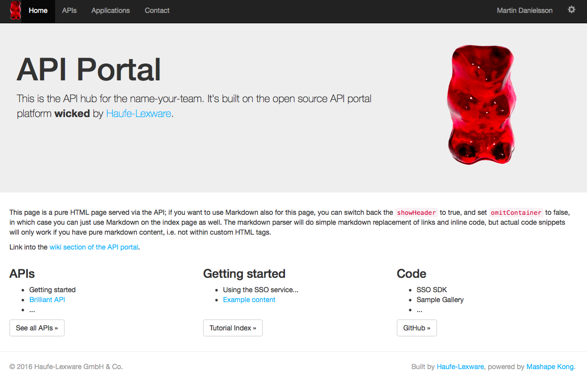
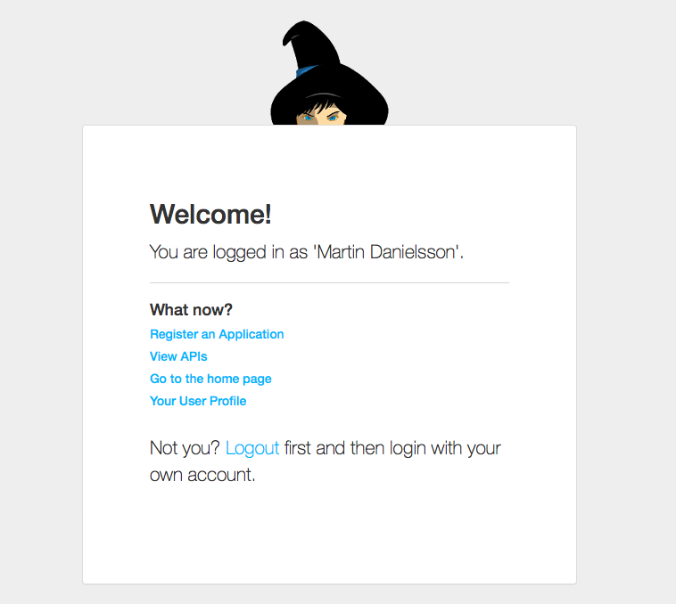
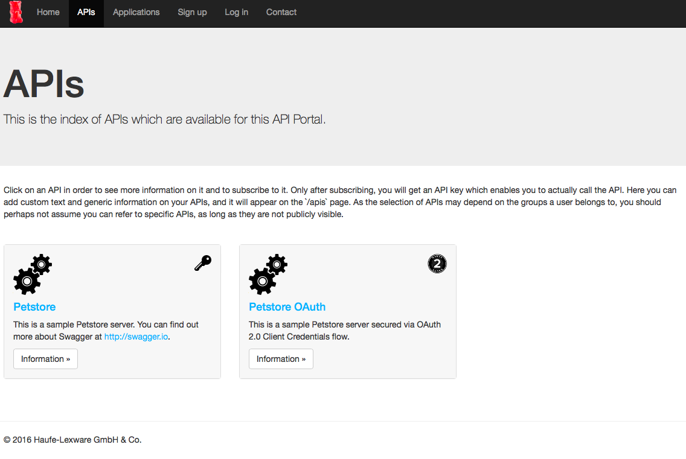

# WORK IN PROGRESS

**This is currently work in progress. We will announce here when we think we have reached a state which makes sense looking closer at.**

Some information can already be seen at the wicked microsite over at [wicked.haufe.io](http://wicked.haufe.io).

Things we are currently finishing currently:

* CI and Build processes, setting up official repositories
* [Documentation (work in progress)](doc/index.md)

Feel free to reach out if you have any questions.

/Martin

## Related repositories

The following repositories contain the actual source code (this repo contains mostly documentation):

* [wicked.portal](https://github.com/Haufe-Lexware/wicked.portal): The API Portal UI
* [wicked.portal-api](https://github.com/Haufe-Lexware/wicked.portal-api): The API Portal backend API
* [wicked.portal-kong-adapter](https://github.com/Haufe-Lexware/wicked.portal-kong-adapter): The API Portal's Kong Adapter service
* [wicked.portal-mailer](https://github.com/Haufe-Lexware/wicked.portal-mailer): The API Portal's Mailer service
* [wicked.portal-chatbot](https://github.com/Haufe-Lexware/wicked.portal-chatbot): The API Portal' Chatbot service
* [wicked.portal-kickstarter](https://github.com/Haufe-Lexware/wicked.portal-kickstarter): The API Portal's Configuration Editor and Kickstarter
* [wicked.kong](https://github.com/Haufe-Lexware/wicked.kong): The Kong Docker image used by the API Portal
* [wicked.mashape.kong](https://github.com/Haufe-Lexware/wicked.mashape.kong): The official Kong Docker image, fork from Mashape

### Home page

### Logged in

### API screen

