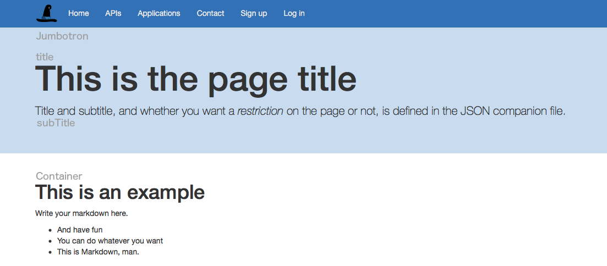
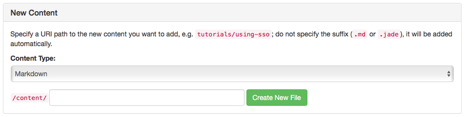
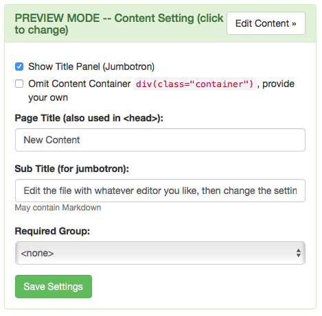
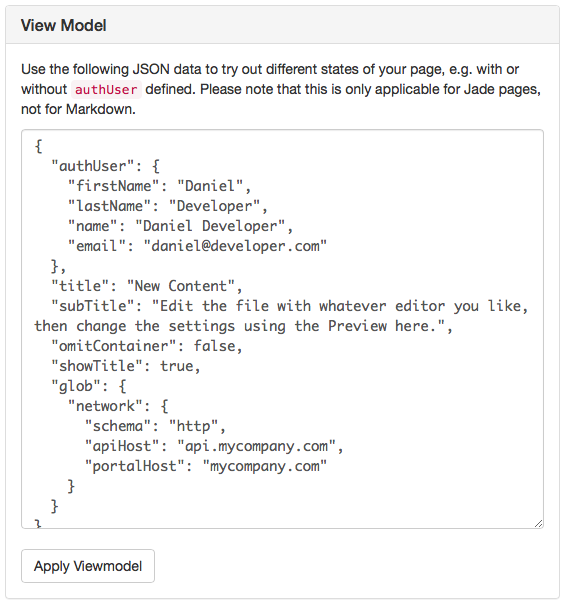

# Adding Custom Content

## Introduction

The API portal can, in addition to the actual APIs, serve additional content, such as markdown pages or html content (as jade files). This documentation describes how that works, both using the kickstarter and manually.

## Prerequisites

The document assumes you have a working API Portal environment and a configuration repository you can work with.

See:

* [Creating a portal configuration](creating-a-portal-configuration.md)
* [Deploying locally](deploying-locally.md)

## Types of custom content

The API Portal supports the following types of custom content, which it will serve with correct media types (in case of binary content):

Textual Content, served as embedded content in the actual API Portal (as a web page):

* Markdown content
* Jade content

Binary Content, always served as a public asset:

* JPG/JPEG images
* PNG images
* GIF images
* CSS files

**Note**: Currently, there is no explicit support for other file types, not even PDF. If there's demand for this, we can think something up, or use some library to do the media type selection.

## Design time

All custom content is part of the configuration repository, and inside that repository, the files are stored inside the `content` directory. If it's a binary file (of one of the types above), you only need to drop the file inside the desired sub directory of `content`, e.g. `content/images`, and the API Portal will be able to serve the file directly.

For Markdown content (`.md` files) and Jade content (`.jade` files), each content file needs to be accompanied by a `.json` file which contains some metadata on the content. These companion files look as follows:

```json
{
    "showtitle": <boolean>,
    "omitContainer": <boolean>,
    "title": "<The page title>",
    "subTitle": "<The page subtitle>",
    "requiredGroup": "<required user group, or omit for public>"
}
```

* **showTitle**: This is a boolean value (either `true` or `false`) which determines whether the content is rendered using the standard Bootstrap "Jumbotron" header as the standard pages, or if you want to leave it out.
* **omitContainer**: When creating standard pages with little or no custom HTML code, you usually want to have the content inside a Bootstrap `<div class="container">` so that it has the rights margins and paddings. This parameter lets you omit that container, e.g. if you want to provide your own container with custom classes or similar.
* **title**: This is the title of the page; it's both used (in case `showTitle` is set to `true`) as the page title in the Jumbotron, and in the `<title>` tag of the HTML header.
* **subTitle**: The subtitle is only used if `showTitle` is `true`; in that case this is the sub title inside the Jumbotron.
* **requiredGroup**: In case you want to restrict the content to logged in users belonging to a specific [user group](defining-user-groups.md), you can do that here. Leave out the property if you want your custom content to be publicly visible, even for non-logged-in users.



In case an `.md` or `.jade` does not have a companion file, the content will not be served (you will get a 404 back).

### Creating Custom Content

When creating custom content, the kickstarter can be of great help in maintaining the companion JSON files. It is definitely a good idea to create stubs using the kickstarter, and then continue editing the files with more able editors, such as Atom or VSCode (for Jade files), or any Markdown editor such as Mou or MarkdownPad 2 for markdown content.

To create a new Markdown file, perform the following steps:

* [Start the kickstarter, pointing to your configuration repository](creating-a-portal-configuration.md#editing).
* Navigate to the [Content](http://localhost:3333/content) index page
* Towards the bottom of the page, you will find the "New Content" panel:



* Specify whether you want a new Markdown (`.md`) or Jade (`.jade`) file
* Specify the path at which you want the content to be served, e.g. `my-example` will be served at `/content/my-example`
* Click "Create new file"

You will then be presented with the preview of the newly created page inside the kickstarter; on this page you can also specify all the options in the companion `.json` file using a web UI.



### Markdown Files

When using Markdown content, the mostly standard Github Flavored Markdown is used, to the extent that the node.js library `marked` is supporting it.

Syntax highlighting for code snippets (using one or three backticks) is also supported, courtesy of highlight.js.

Markdown is especially useful for documents which have a suitable structure, and which do not need "fancy" things such as elaborate tables or other HTML elements which do not map one to one with markdown.

If you need more control over how the content is rendered, you will have to resort to using Jade content.

### Jade Files

As a second major content type, Jade files are supported. Jade is a templating language for HTML, you can read up on the syntax at [jade-lang.com](http://jade-lang.com).

When using Jade, you have full control over the HTML which is output, and you may also use the entire Bootstrap library which is part of the API Portal distribution, and is always part of every web page served by the API Portal. Bootstrap 3 is currently used, and the documentation is at [getbootstrap.com](http://getbootstrap.com).

#### Using the View Model in Jade

A second advantage of using Jade is that you can make use of the current state of the user's session, by referring to the variables which are passed in to the Jade page at render time.

The view model is built up as follows for all custom content pages:



* **authUser**: The property `authUser` contains information on the logged in user; you can expect `firstName`, `lastName` and `email` to be filled. If there isn't any logged in user, `authUser` will not be present. This can be used to display slightly different things when a user is logged in, using a `if authUser` Jade statement.
* **title**, **subTitle**, **omitContainer**, **showTitle**, **requiredGroup**: These are the settings from the abovementioned JSON companion file; these will be copied from the companion file into the view model of the page
* **glob**: This is the `globals.json` file of the configuration repository. Pay close attention that this variable may contain clear text credentials, so don't blindly output information from this variable. In some cases it may be useful to know the API host or Portal host, which are stored in the `glob.network` object.

For an example of how a Jade page is leveraging the view model, see the predefined `index.jade` page.

### Predefined Content files

#### Predefined markdown and Jade files

In a fresh configuration repository, there are already a couple of predefined files inside, which are described in detail further below:

* The main index: `index.jade`
* The contact page: `contact.jade`
* An example markdown page: `example.md`
* An example restricted markdown page: `restricted.md`
* The main stylesheet `wicked.css`

Additionally, the following two pages are pre-packaged:

* An example privacy policy you may use as a starting point for your own privacy policy: `privacy-policy.jade``
* A documentation describing "Terms and Conditions": `terms-and-conditions.jade`.

Of these files, only `example.md` and `restricted.md` *may be removed entirely*, all other pages, including the privacy policy and terms and conditions are being linked to by standard pages of the API Portal, and thus are required to be present as they are, having the exact names.

#### Predefined images

With an initial configuration also come some images:

* `animal.jpg` is used on the `example.md` page and can be safely removed if you do not need a stag someplace (ahem)
* `arrow-left.png` and `arrow-right.png` are used on the initial `index.jade` page; if you rewrite the main page, you can safely remove these files from your configuration repository

The next two images are not optional, and need to be present:

* `wicked-40.png`: This is the logo which is displayed in the top left corner of every web page the API Portal serves. If you replace this image with something else, make sure it has the same dimensions as this image.


* `wicked-auth-page-120.png`: This file is used as a logo image on the login and signup pages. You may replace this logo, but it should have the same dimensions as this file to make sure the web pages still look good.


## Run time

At run time of the portal, the content files are all served at `/content/...`, with the single exception of the index page (`/`), which is both served from `/` and `/content`.

Depending on the companion JSON file, you may need to log in to view the content pages (and have the correct user group assigned to you). All binary content (images) are currently served without checking whether a user is logged in or not.
