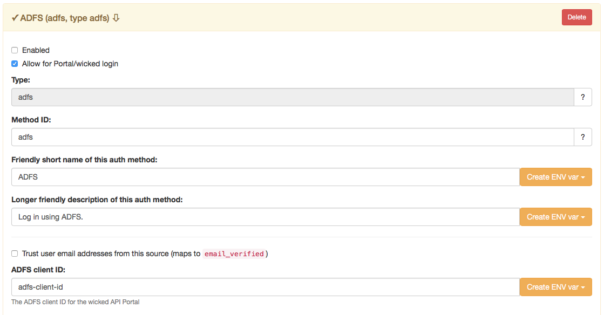
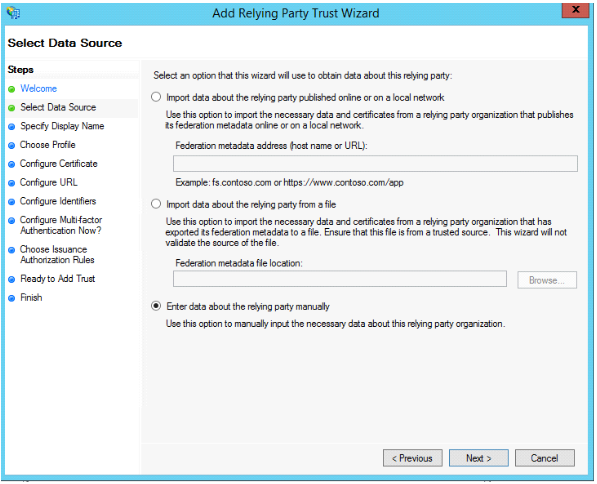
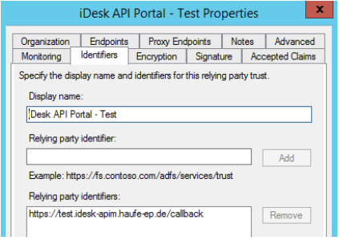
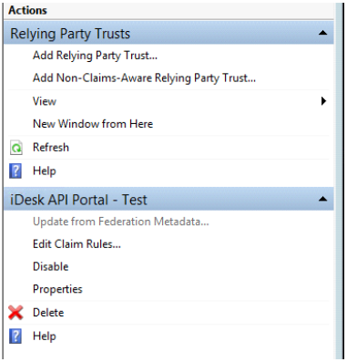
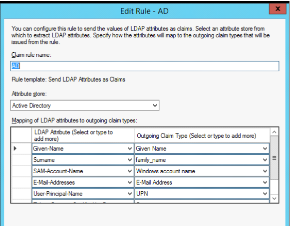
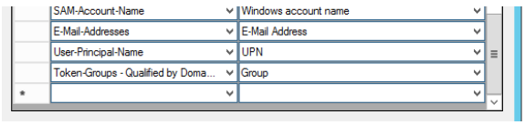
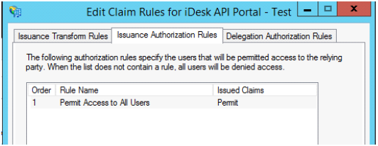

**Prerequisites**: Read up on "Auth Methods" first to make it easier to understand how this works.

# Configuring ADFS 3.0 Login

wicked can use an ADFS to authenticate users against, both for the portal UI and any API you would want to secure using ADFS identities. You can define as many ADFS integration as you need by using the default Authorization Server for wicked.

The configuration has to be done both for the API Portal and on the ADFS Server in order to make the services "know each other".

## Wicked configuration

It is assumed that you have a running Kickstarter instance; open the [Authorization Server](http://localhost:3333/authservers/default), 



Tick the "Enable" end point, and depending on your needs, also tick the "Allow for portal/wicked login" to enable ADFS login also for the development portal.

Fill in the needed fields.

* **Authorization URL**: The Authorization end point of your ADFS instance (usually ending with `/adfs/oauth2/authorize`)
* **Token URL**: The Token URL of your ADFS instance (usually ending with `/adfs/oauth2/token`)
* **Client ID**: This is a value selected **by you**; use e.g. a GUID to make sure the client ID is unique. This ID is the ID which identifies the portal with the ADFS Server.
* **Client Secret**: This is not used for this scenario, fill in anything
* **ADFS Resource (Claims)**: The identifier (as a URI) of the resource claims the ADFS server should return. This can be used for multiple ADFS OAuth2 clients; select an ID you can identify as belonging to your API Portal. This will be the "relying party trust identifier". E.g,. `https://portal.yourcompany.com/adfs/trust`
* **Public Certificate to verify Callbacks with**: This is the certificate used to sign JWT tokens with; the portal uses this signature to verify that the callback actually comes from the ADFS instance it claims to come from. Has to be in PEM format. See below for information how to retrieve.

Save the configuration and redeploy your configuration. The ADFS signin and signup buttons should now be visible, but will not work just yet.

### Getting the signing certificate

#### Converting from `.CER` format

In case you have the certificate as a Microsoft `.CER` file (which is in DER binary format), you can use `openssl` to transform it into the PEM format with the following command:

```bash
$ openssl x509 -in /path/to/signing-cert.cer -inform der -out /path/to/signing-cert.pem -outform pem
```

#### Getting from a running ADFS instance

In case you have a valid SAML metadata.xml configuration endpoint at hand, you can use the tool `adfs/get-adfs-signing-cert.js` to extract the signing certificate from that end point:

* See [https://github.com/Haufe-Lexware/wicked.portal-tools](https://github.com/Haufe-Lexware/wicked.portal-tools)

## ADFS Server Configuration

On your ADFS Server, perform the following steps.

### Register a new ADFS Client using PowerShell

In the "Windows Azure Active Directory Module for Windows Powershell" (possibly run as Administrator), issue the following command, replacing the `Name`, `ClientId` and `RedirectUri` with the appropriate values from above:

```
> Add-ADFSClient -Name "Unique Name for your Portal" -ClientId "46313fc2-29ab-420a-9e75-2c79da3e91f9" -RedirectUri "https://portal.yourcompany.com/callback"
```

Please note that you can allow multiple Redirect URIs, which can be nice to do if you have multiple instances of your Portal (e.g. Dev, Test and Prod) running the same configuration. The ADFS Server would then accept different Redirect URIs with the same kind of registration. Another valid option is to have multiple registrations for the different instances; in that case you will have to re-do this step for every of your environments.

**IMPORTANT NOTE**: To get the redirect URI, make use of the button "Display Callback URIs" which generates the callback URIs you need to use when connecting the ADFS with Wicked. Note that depending on your environments configuration, the callback URIs will be differing:


### Configuration "Relying Trust Party"

The second step is to define which data fields are returned as the authenticated profile when logging in. This is done by configuring the relying trust party.

First, open the "Add Relying Trust Party Wizard" and specify that you want to manually enter values for the relying party:



Configure the generic settings and give the new relying trust party a name. Add the relying party claims identifier you specified in the authorization configuration above as a trust identifier (above this was `https://portal.yourcompany.com/adfs/trust`). This is how ADFS knows which claims to send back.



After this, you will have to edit the claim rules by clicking the "Edit Claim Rules..." option; this will define exactly what is sent back as the profile to the portal:



In the dialog box, configure the following fields:

* Given Name to `given_name`
* Surname to `family_name`
* E-Mail address
* User-Principal-Name as `upn`
* Windows Groups as Group


<br>


As a last step, make sure all (if applicable) users are allowed to retrieve this information for this claim rule:



**IMPORTANT**: If you have several instances of wicked, there is **no need** to create separate resource definitions for each instance - they can safely use the same rule.

## Verifying ADFS Callbacks

It is recommended that you verify the profile returned by the identity server using its public certificate. This can also be defined in the ADFS settings using the kickstarter. The public certificate can be given to you from your ADFS administrator.

Without this setting, it would in principle be possible to spoof a login via ADFS.

## Testing

In order to troubleshoot any issues, you may define the following diagnostic settings for the `portal-auth` container: Make sure the container starts with the following environment variable set:

```
LOG_LEVEL=debug
```

The `portal-auth` container will then output debug information, including full received profiles for the logged in users, as JSON structures. You can then either tweak the claim rules or the wicked configuration to make the field names match, if e.g. names or email addresses are not retrieved correctly.

This also allows you to see whether groups (see below) are correctly passed in to the portal. 

## ADFS Group Federation

A special feature of the ADFS Login federation is that you can identify [API Portal user groups](defining-user-groups.md) with ADFS User Groups. This makes it possible to pre-define e.g. Admin Users or special Developer groups which have immediate access to various APIs or API Plans without being known beforehand in the API Portal.

Another valid option would be to have an ADFS Group "API Admins" which will without pre-registration always be members of the `admin` group.

This can be specified using the ADFS group to wicked group mapping tool:


**See also**:

* [Defining User Groups](defining-user-groups.md)
