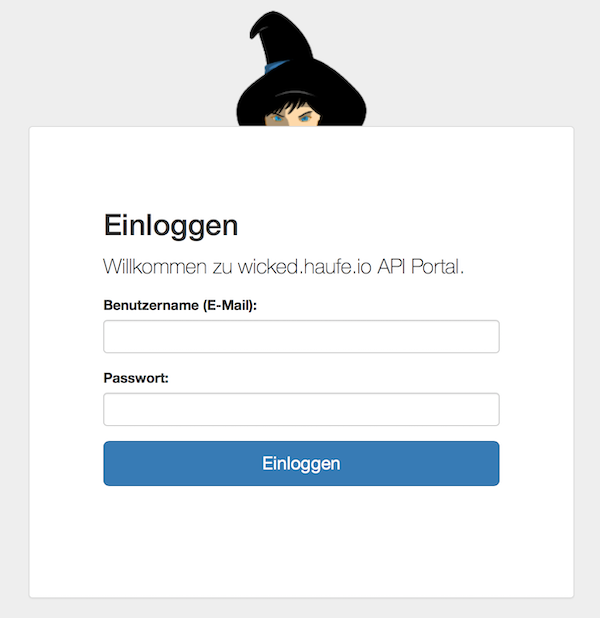
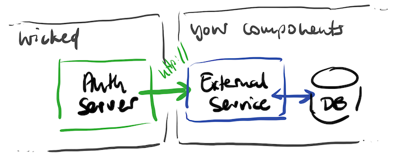

# External Authentication

In some cases, an existing user database must be used to validate usernames and passwords. wicked.haufe.io can integrate with such databases by a lightweight API to enable full OAuth2 functionality based on an existing username/password database.

To implement this, create a new [auth method](auth-methods.md) with the type `external`.

## Configuration

The auth method type `external` has two main configuration properties (in addition to the generic ones):

* URL to validate username/password
* URL to allow or disallow token refreshes

More information on this can be found in the wicked Kickstarter, and in the documentation of the request and response types in the wicked node SDK documentation:

* [ExternalUserPassRequest](https://apim-haufe-io.github.io/wicked.node-sdk/interfaces/_interfaces_.externaluserpassrequest.html)
* [ExternalUserPassResponse](https://apim-haufe-io.github.io/wicked.node-sdk/interfaces/_interfaces_.externalrefreshresponse.html)
* [ExternalRefreshRequest](https://apim-haufe-io.github.io/wicked.node-sdk/interfaces/_interfaces_.externalrefreshrequest.html)
* [ExternalRefreshResponse](https://apim-haufe-io.github.io/wicked.node-sdk/interfaces/_interfaces_.externalrefreshresponse.html)

## How this works

This auth method enables using all OAuth2 flows with an external username/password database. The only thing which has to be done is to implement the above two endpoints which interfaces with your existing user/password database.



The following flows work:

* Authorization Code Grant
* Implicit Grant
* Resource Owner Password Grant
* (Client Credentials flow; this does not involve and users, so this always works)

Whether it is allowed to use this flows is subject to how you configure your APIs.



## Extensions

### `prefill_username`

The `/authorize` endpoint of the external auth method supports prefilling the username for the login screen. This can be useful for cases where the email adress/username is checked in a different place, and the user is then redirected to this authorization endpoint.

Example:

```
https://api.portal.com/auth/external/api/some-api/authorize?client_id=abcdefg&response_type=code&redirect_uri=http://localhost:3000/callback&prefill_username=some@user.com
```
