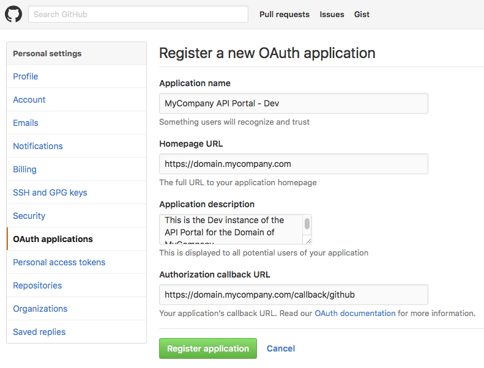
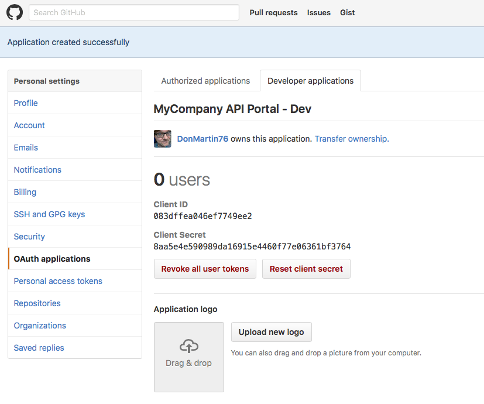
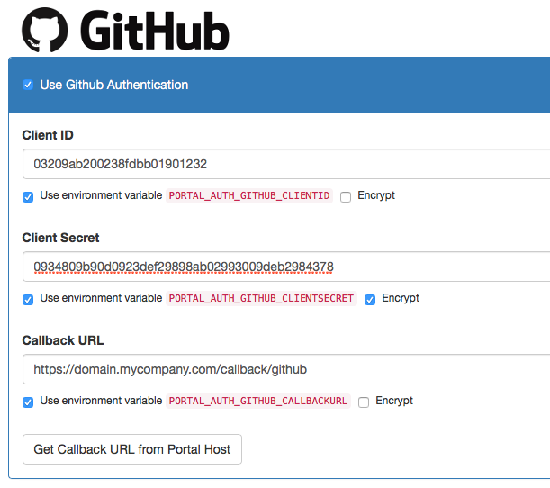

# Configuring Github Login

**NOTE**: It makes sense to have read up on Authorization Servers and Auth Methods.

## Introduction

Wicked can use Github for federating user logins to the Portal UI, and to authenticate users using your API. Users which are logged in using Github Social Login will automatically be registered for full use of the API Portal:

* The primary email address which is used with Github is taken as a verified email address in the API Portal automatically (the user is auto-verified)
* Name and email address are automatically retrieved from Github
* The ID from Github is used as a unique id (prepended with `<auth method id>:`) in the API Portal

This is probably a good fit for most public facing developer API Portals, as most developers tend to already have a GitHub account.

## Step 0: Prerequisites

You need the following things:

* A running [kickstarter](creating-a-portal-configuration.md), pointing to your configuration repository
* The fully qualified domain name (FQDN) of your API Portal(s)
* A valid GitHub account and access to the Account or Organization you want to create a login for

## Step 1: Register your API Portal(s)

Perform the following steps on [GitHub](https://github.com) to register your API Portal as a developer GitHub application:

* Open the Settings Tab, and open the [OAuth applications/Developer Applications](https://github.com/settings/developers) panel
* Click the "Register a new application" button
* Specify all needed fields:
    * **Application Name**: State a speaking name for your API Portal, e.g. "MyCompany API Portal DEV"
    * **Homepage URL**: This should point to the main page of your API Portal, e.g. `https://domain.mycompany.com`
    * **Application Description**: Write more information on the API Portal here; this will be displayed when Github users log in to the API Portal
    * **Authorization callback URL**: See below how to generate this.

This is a little stupid as a todo list, but continue now with Step 2 in the mean time (open in parallel)

* Click "Register application"
* You will be presented the Client ID and Client Secret which are needed to configure your API Portal:

**Notes**:

* You will need separate GitHub applications for separate instances, e.g. for Dev, Test and Prod; each have a different set of credentials
* By registering a `localhost` callback URL, you can register a separate local testing application; this works just fine if you are in a developer setup
    * You could also register a DNS name you have specified in your `/etc/hosts` (or on Windows, `HOSTS` file) with GitHub. As OAuth 2.0 is a purely client side redirect flow, this will also work just fine, as long as your local browser is able to resolve the DNS name.
    * Combine this with a [`localhost` or `development` environment](deployment-environments.md) for most flexibility.

## Step 2: Configure the API Portal

Next, you need to configure the API Portal to know the GitHub credentials. To do that, open up the kickstarter on the [Default Authorization Server](http://localhost:3333/authservers/default), and open the predefined "GitHub" auth method:

Fill in the needed fields. Note that it may make sense to make the Github credentials environment variables to (a) encrypt them at rest, and (b) enable different Github application registrations for different runtime environments.

Now all you have to do is to check in your changes to source control and redeploy your API configuration. GitHub social login should now be working.

### Getting Callback URLs

Use the "Display Callback URLs" button to display the callback URIs per environment which are needed to register the application with GitHub.