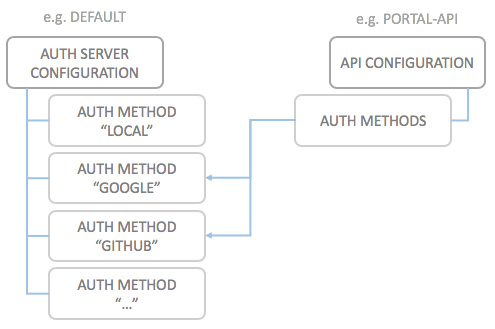

# Auth Methods

The default [Authorization Server](authorization-servers.md) supports various ways of establishing the user identity for use with OAuth2.0 flows. Each of these ways are called **Auth Methods**.

An Auth Method can be "use wicked's local user database", or "use a Google identity". Any Auth Method which has been successfully configured with the default authorization server can be used to

* Secure access to any API
* Secure access to the wicked API, and by corollary to the wicked Portal UI

## Configuration Architecture

The following image shows where auth methods are configured and how they are linked to the API configuration:

An Authorization Server has a set of defined Auth Methods (with IDs). In the API configuration, any (OAuth2 secured) API can be linked to one or more auth methods from the authorization server configuration.

In the image, the example API is the wicked portal API, which is also linked to a set of auth methods of the default authorization server.

The wicked Kickstarter assists you in editing and creating auth methods, and also in linking APIs to using these auth methods.

## Available Auth Method types

Currently, wicked supports the following Auth Method types, which can be used both for the API Portal itself, as well as for securing APIs:

* [`local`: Local username and password authentication](auth-local.md)
* [`google`: Google+ login](auth-google.md)
* [`github`: Github login](auth-github.md)
* [`twitter`: Twitter login](auth-twitter.md)
* [`oauth2`: Generic OAuth2 login](auth-oauth2.md)
* [`adfs`: Microsoft ADFS login](auth-adfs.md)
* [`saml`: SAML based login](auth-saml.md)
* [`external`: External checking of username/password](auth-external.md)
* [`ldap`: Authenticate with an LDAP Server](auth-ldap.md)

In the future, there will be additional auth methods, such as 

* OpenID Connect (may be added to `oauth2` as a special case of getting profile data)

## Protected Auth Methods

You can specify an auth method to be "protected". This has the following effects:

* The auth methods is not displayed in the documentation of an API which is configured to be used with this auth method
* Administrators of the API portal will still be able to see the auth method
* Such an auth method is not displayed as a "login" button on the wicked portal, in case it is also configured to be used to log in to the wicked portal
* To enable logging in with a protected auth method to the wicked portal, use the following type of URL: `http://your.portal.com/login?auth_method=<id>`
* Such an auth method will be stored as a cookie, and will also be displayed automatically the next time the usual `/login` page is displayed
* Currently, only one additional auth method can be displayed using this method; if you call the `/login` page using a different auth method (or an auth method which does not exist), the previous one will no longer be displayed.

This can be used for example with corporate SSO providers where it's not wanted to display the corporate SSO option unless you have the "special link".

Please note that this is not actually a security measure, but rather a "cosmetic" measure to not display too many custom identity providers to your APIs. This is especially useful for situations where your product has many enterprise SSO login options.
