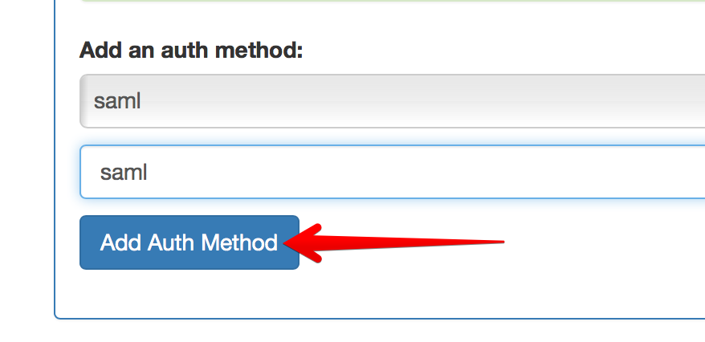
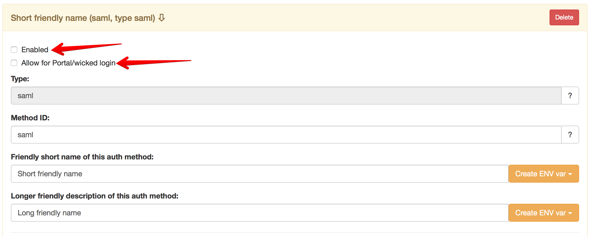
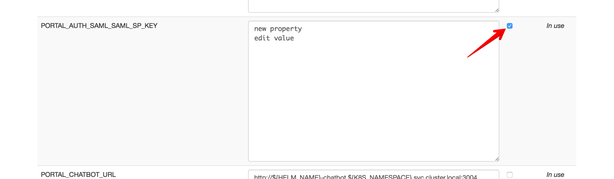
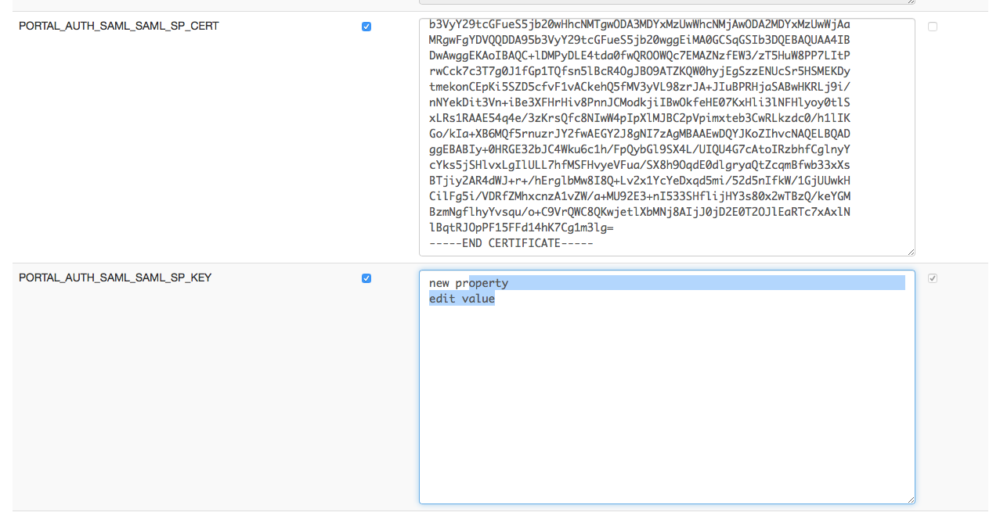

# SAML Authentication

The wicked Authorization Server can federate SAML identities to the OAuth 2.0 Authorization Code and Implicit Flows.

Using SAML requires some configuration on the Authorization Server; it is assumed that you have a running [Kickstarter](creating-a-portal-configuration.md) and that you have opened the [Authorization Server page](http://localhost:3333/authservers/default).

It is further assumed that you are familiar with the concept of [Auth Methods](auth-methods) and what the [Authorization Server](authorization-servers.md) does.

## Create a SAML Auth method

### Step 1: Define a new auth method ID

In the "Auth Methods" panel, add a new auth method with type `saml`, giving a unique auth method id:



A new panel with a generic name will appear (in yellow), where you can specify friendly short and long names, and where you can specify whether you want to enable the auth method, and/or whether you want to enable this auth method for logging in to the portal UI:



Click "Save" on the top of the page (in the status bar) to save the settings.

### Step 2: Creating Service Provider certificates

Wicked acts as a SAML Service Provider to the SAML Identity Provider, and as such needs to have a certificate/private key pair to identify itself to the identity provider. If you do not have such a certificate, you can use `openssl` to create one:

```
$ openssl req -x509 -newkey rsa:2048 -keyout saml-key.pem -out saml-cert.pem -nodes -subj "/CN=yourcompany.com" -days 730
```

Replace `yourcompany.com` with something more appropriate; the certificate is a self signed one, but this is okay for this purpose.

Depending on how many environments you are using ("Dev", "Test", "Prod"...), you will need to repeat this step for each environment you want to wire with the Identity Provider.

### Step 3: Acquiring IdP certificate and wire certificates in environments

To enable verification of IdP responses and to enable the IdP to verify wicked's requests and responses, you will also need the certificate of the Identity Provider. This is part of the SAML metadata of the Identity Provider; in case of doubt, your IdP responsible person will be able to get you this information.

All certificates and private keys will now need to be specified as environment variables in the [Environments](http://localhost:3333/envs) section of the Kickstarter. Looking at the sections "SAML Service Provider options" and "SAML Identity Provider options", you will see that in each section, some environment variables were introduced. Depending on the auth method ID, they are named similar to `PORTAL_AUTH_SAML_<id>_SP_CERT`, `PORTAL_AUTH_SAML_<id>_SP_KEY` and `PORTAL_AUTH_SAML_<id>_IDP_CERT`.

Open the [default environment](http://localhost:3333/envs/default), look for the `PORTAL_AUTH_SAML_<id>_SP_KEY` variable and tick the "encrypt" check box:



Find the `PORTAL_AUTH_SAML_<id>_IDP_CERT` environment variable and paste the IdP certificate there.

Then save the default environment. Now you need to update the other environments; go back to the [environment overview](http://localhost:3333/envs) and open the different environments you need to add the certificate and key for.

In the environment editor, you may now paste the certificate and private key, and the identity provider certificate into the corresponding fields:



### Step 4: Profile Mapping

In the next step, you will need to map SAML attributes to profile properties; this is very depending on the configuration of the Identity Provider, so there are no "recipes" which will work for all types of identity providers.

For wicked, it is **mandatory** that at least the following fields are filled:

* `email`: The email address of the authenticated user
* `sub`: This must be a **unique identifier** in the realm of the remote identity provider

It is also recommended to fill in the following field:

* `name`: The display name (full name) of the authenticated user

The mapping mechanism uses [Mustache Templates](https://mustache.github.io); please note the use of triple curly brackets to avoid Mustache translating e.g. Umlauts to HTML entities: `{{{first_name}}} {{{last_name}}}`.

### Step 5: Deploy the new configuration

