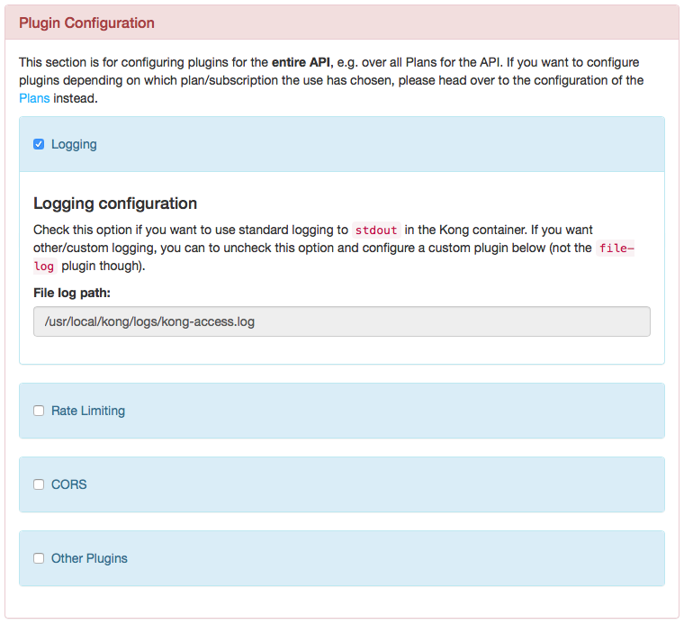
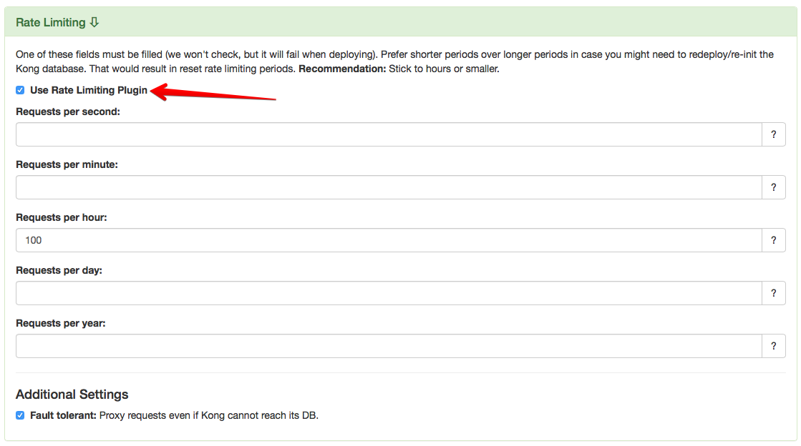
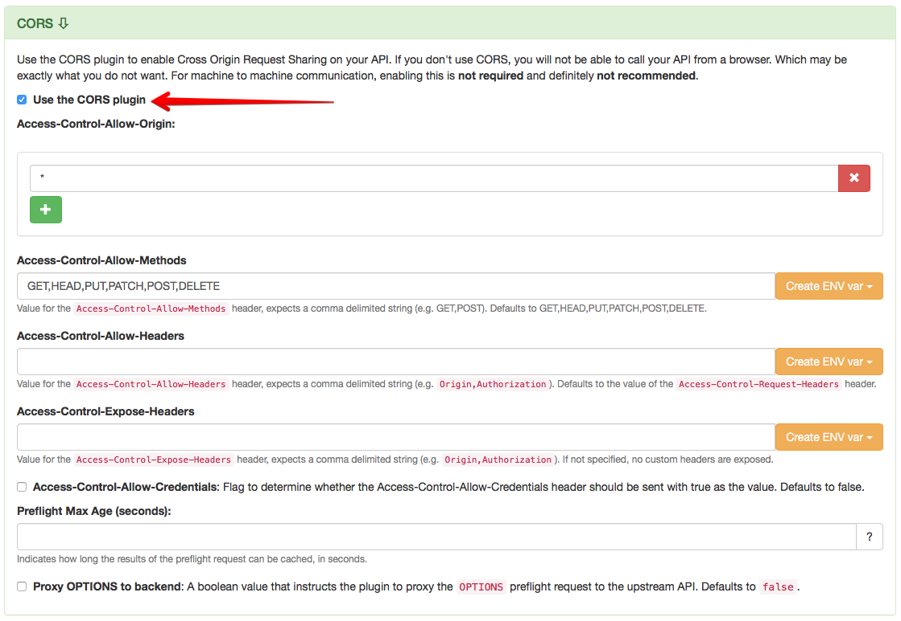
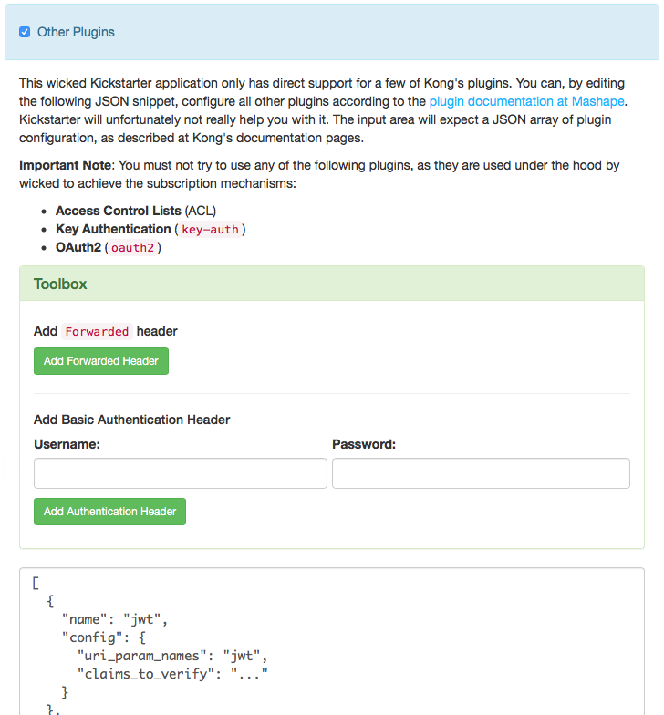
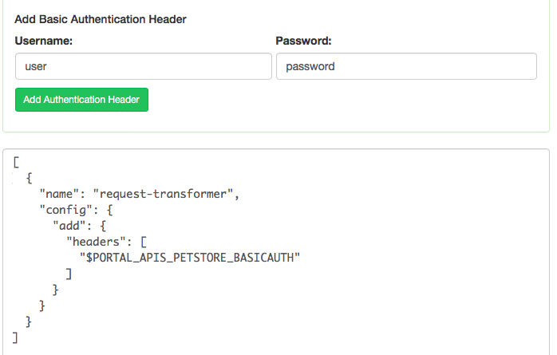
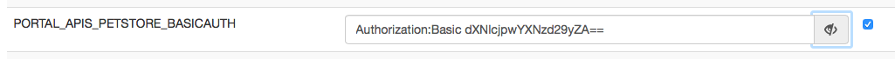

# Configuring Kong Plugins

## Introduction

In case you have to change something when proxying a request via the API Gateway, you can do that via Kong Plugins. Some of the functionality which the API Portal provides out of the box are actually - under the hood - leveraging Kong's plugin mechanism. This applies foremost to the authentication mechanisms (via API Key or OAuth2), where the plugins `key-auth`, `acl`(Access Control Lists) and/or `oauth2` are automatically configured to achieve the desired effect (i.e. protecting the backend API against unauthorized calls).

## Kong's modus operandi

Mashape Kong knows, very coarsely speaking, four different entities which it works with for configuration:

* Services
* Routes
* Consumers
* Plugins

**Services** and **Routers** are the entities Kong uses to know which end points to proxy to which backends. This is what you configure when you [define APIs for use with the API Portal](defining-an-api.md).

For Kong, **Consumers** are entities which can be used when applying plugins to API routes. Kong is agnostic to what kind of Consumer may be behind (e.g. "User", "Application",...), this is up to the API Gateway operator to decide. For the wicked API Portal, consumers map to API **Subscriptions**, i.e. a combination of an API, an Application and an API Plan.

In order to achieve desired effects on the API routes, e.g. rate limiting or access control, Kong makes use of **Plugins**. Most plugins can either be applied to an API, to a Consumer, or to a combination of both (which then applies the plugin for a specific API for a specific consumer).

In most cases, you will not need to bother very much about the explicit configuration of the plugins, as the API Portal does this for you, but there are some things which are important.

## Which Plugins are used out of the box

The following plugins are used by the API Portal "under the hood", and **MUST NOT** be configured multiple times:

* `key-auth`
* `acl`
* `oauth2`

In order to achieve the functionality of the API Portal and Gateway, the Kong adapter works as follows:

* For each API, configure an Access Control List (the `acl` plugin) and set it to contain only a group called exactly as the API
* For each subscription in the API Portal
    * Create a consumer named after the API and Application it is for (e.g. `my-app$users-api`)
    * When using API keys, add the `key-auth` plugin for this consumer, so that passing in the API Key as a header will immediately identify this consumer when calling the backend
    * When using OAuth 2.0 Client Credentials, add the `oauth2` plugin, so that the token which is issued can be used to identify the Consumer which was created
    * Add the consumer to the `acl` group of the API for which the subscription is valid
* In case the subscription plan has a plugin defined, this plugin is also added to the API, giving the `consumer_id` as a restriction for the plugin; this enables having e.g. different rate limiting settings for different consumers/subscriptions, depending on the API Plan.

This mechanism ensures that each API key can only be used for one subscription to one API (for one application).

## Supported Plugins

The API Portal kickstarter has support for selected Kong Plugins, for which there exists a simple way to configure them. These are the following plugins:

* Correlation ID
* Logging (only API level)
* Rate Limiting
* CORS (only API level)
* Prometheus

To some extent, also the `request-transformer` plugin is supported, which makes it possible to add or delete specific parts of requests, e.g. adding headers.

The plugin configuration can be found for both Plans and API Kong Configurations. This is supported in the kickstarter:



### Correlation ID

Use this plugin to insert a correlation ID (`Correlation-Id`) header into the proxied request. If such a header is already present, simply pass it on. Otherwise create a new one, based on a UUID.

### Rate Limiting

The rate limiting plugin documentation is partly self documenting in the kickstarter; for more information also see the [plugin documentation](https://getkong.org) on Mashape's Kong pages:



### CORS



TODO: Currently, there is no way to use registered application's hosts as `Origin` in this setting. This is due to a limitation of the Kong Plugin, which is not able to use more than a single origin host currently. This is about to change (see e.g. [PR #1774 in Mashape/Kong](https://github.com/Mashape/kong/pull/1774), and then a varying origin header may be supported here.

### Prometheus

The wicked Kong adapter will automatically configure Kong in a way that it exposes its standard metrics regarding services and routes. If your are using the standard [Helm chart](../wicked), the (hopefully) correct annoatations are already specified for the Kong containers. If you need to set up this manually, Kong will expose its metrics as `http://<kong ip>:8001/metrics`; this means that the administration port 8001 must be available to your Prometheus instance for scraping.

### Other Plugins

If you need addition Plugin Configuration, you can use the kickstarter's "Other Plugins" functionality. It just lets you edit the JSON configuration of the plugin section of an API or Plan. This means you obviously have to know to write a correct configuration, according to the Kong plugin documentation.

There are currently two special things which kickstarter can help you with: Adding specific headers using the `request-transformer` plugin; this is described below.



#### The `Forwarded` Header

Use the "Add Forwarded Header" in order to configure Kong to always send a `Forwarded` header, following the [RFC 7239](https://tools.ietf.org/html/rfc7239) recommendation. This will make the API Gateway always add a header in the following form:

```
Forwarded: host=api.yourcompany.com;proto=https;prefix=/apiprefix;port=443 
```

#### Adding Basic Auth to the Backend Service

Using the same plugin, kickstarter can also be used to define a `Authorization: Basic ...` header for backend authorization. It works in a similar way as the `Forwarded` header, with the following difference: The header value is not directly written into the configuration, but is (as it's a credential), put into an environment variable:



The environment variable can in turn be reviewed in the "Environments" section, where you both can change the value of the variable, or define alternate values for different environments, e.g. if you use different credentials for different environments:



The kickstarter will by default encrypt the credentials, which probably makes sense.

#### Other Kong Plugins

Other Kong Plugins can be used to achieve other behaviors, such as

* Whitelisting
* Blacklisting
* Rate Limiting over data size
* ...

## Future Work

If you need configuration UI for other plugins, please raise an Issue.