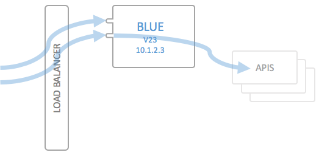
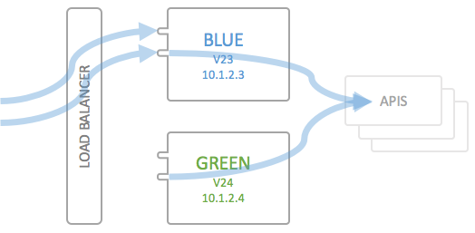
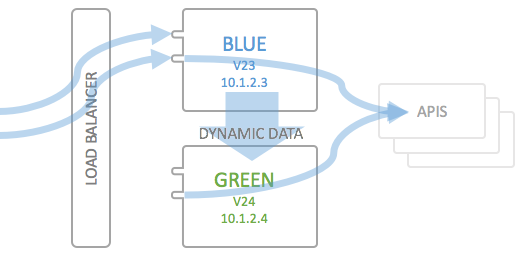
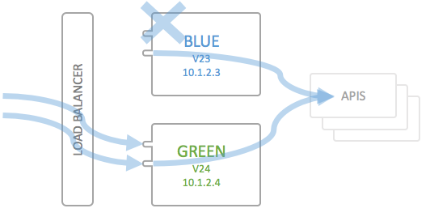
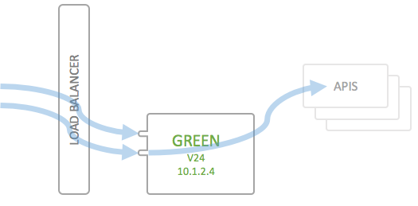

# Continuous Integration/Continuous Deployment

The API Portal is designed to be built up of immutable servers in the following sense: Everything which is not "user supplied" data, such as user accounts, applications and subscriptions, is considered static configuration, and **cannot** be changed after the deployment. If you need to change a configuration setting, such as API definitions or User groups, you will need to redeploy the API Portal with the updated configuration. 

This is intended behavior, but it does mean that you will have to set up a real CI/CD system for your API Portal. If you have little or no experience with this, the API Portal may be a useful testing object, and if you already have such a system in place, the API Portal should fit in quite nicely.

The advantages of immutable servers are quite striking:

* *Configuration Drift* is impossible: Any configuration of the system is contained in source control; you cannot change a running system without redeploying from scratch
* You are always able to *spin up a new instance* from scratch, which makes a good (albeit not perfect) desaster recovery plan
* The approach forces you to *automate deployments*, which is very important to make the CI/CD approach work

The API Portal can be deployed continuously using different approaches, which have some differing properties:

* Simple deployment using `docker-compose`
* Test Deployments using the dynamic configuration of the target system
* Blue/green deployment of the entire system

The API Portal has a deployment API which can be used to extract and import the dynamic configuration (see also the [deployment architecture](deployment-architecture.md) of the API Portal); depending on your requirements in terms of downtime and availability, you need to use this API, or not.

The following documentation assumes that you are familiar in the use of the following tools and that you have an environment up and running:

* Docker
* Docker's `docker-compose`

See also:

* [Deploying Locally](deploying-locally.md)
* [Deploying to Production](deploying-to-production.md)
* [Configuration Versioning Strategies](versioning-strategies.md)

# Deployments without the deployment API

Deployments not leveraging the deployment API are very simple and straightforward, but do not allow you to do zero-downtime upgrades. In some cases, this will not be a big issue, in some other cases it may be. For development and testing purposes, this may be enough though, and in some cases, also production systems can be updated using this mechanism, as the expected downtimes are mostly very short (under a minute usually).

## Simple deployments using `docker-compose`

This section assumes that you have successfully deployed your API Portal to a docker environment, and you now want to update the system in some way. The most common scenarios are the following:

* Update of the static configuration (configuration repository)
* Update of the API Portal components (API Portal system)
    * The API Portal itself
    * The Kong API Gateway

As described in the [deployment guideline](deploying-to-production.md), you will have a `docker-compose.yml` file you use to
 
* Build the static configuration [container](docker-images.md),
* Deploy the API Portal and Gateway to a Docker host

This file is the base for each deployment or update/upgrade of the API Portal.

### Updating the static configuration

In order to update the static configuration, you will have to perform the following steps using `docker-compose` against your Docker host (which runs your API Portal):

1. `docker-compose build`: This will build the [static configuration image](docker-images.md), this is the same step as described in the [deployment guide](deploying-to-production.md). You will need to set the `REPO_HOST`, `REPO_CREDS` and `REPO_PATH` environment variables correctly for this to work. Please note that the configuration is only build into the docker host, it is NOT pushed to a registry (and should not be either!)
2. `docker-compose rm -fv portal-api-data-static`: This removes the previous static configuration container (which is mounted into the `portal-api` container)
3. `docker-compose up -d --remove-orphans portal-api-data-static`: This creates and starts the configuration container so that it's available for the `portal-api` during the next step. Note that this container immediately stops (the entrypoint is `/bin/true`), as it's a data only container.
4. `docker-compose up -d --remove-orphans --force-recreate`: This restarts the API Portal using the new configuration container; as soon as this command has finished (plus a couple of seconds), your API Portal should be back up again.

All `docker-compose` calls assume that you have set all the necessary environment variables as described in [deploying to production](deploying-to-production.md).

This method will cause a downtime of 15-120 seconds for both the API Portal and the API Gateway, depending on the size of the deployment and the speed of the Docker host you are deploying your system to.

### Updating the API Portal Components

An update of the API Portal components is actually very straightforward, as you only have to make sure the latest [docker images](docker-images.md) are pulled prior to redeploying the API Portal as in the above section. This can easily be done using

```
docker-compose pull
```

Continue as in "Updating the static configuration" above. Like in the above case, this is an update which entails a certain amount of downtime, and as such should perhaps not be used for production deployments.

In most cases, an update of the API Portal components (which usually include the Kong Gateway and the Postgres component) will not require you to remove the data volume which is used by Postgres to store runtime information for Kong. In some cases, an upgrade of the data schema is necessary though, but these cases will be described thoroughly in API Portal release notes as soon as they occur. As long as you stick to a given version of the API Portal components, you can be sure not to encounter such a situation.

### Help! My Portal API throws errors at startup

The `portal-api` container will do a sanity check at first startup, to make sure the dynamic configuration (which is persistent in the dynamic data container) matches the (possibly) new static configuration. The following things are checked:

* Do all API definitions refer to valid API Plans?
* For all subscriptions in the dynamic configuration:
    * Does the subscription plan exist in the static configuration?
    * Is the subscription plan valid for the subscribed API?
    * Does the API for which there is a subscription exist in the static configuration?

If any of these sanity checks fail, the `portal-api` container **will refuse to start**.

# Deployments leveraging the deployment API

## The deployment API

Each API Portal deployment comes with a predefined deployment API which is exposed over the API Gateway endpoint. The Swagger documentation of the end point is included in the [source code](../portal-api/swagger/portal-deploy-swagger.yaml). All end points of the API require authorization, via the following header:

```
Authorization: <deployment key>
```

Whereas the `<deployment key>` is the encryption key you created using the kickstarter (see [creating a portal configuration](creating-a-portal-configuration.md)).

The deployment API **exclusively** is able to retrieve the dynamic data of the API Portal; the static configuration (from the configuration repository) is not deployable using the deployment API, and this is by design like this (and not likely to change). Everything which is part of the configuration repository has to be deployed using an actual deployment of the API Portal; only the dynamic data (users, applications and subscriptions and some more things) is considered here. 

**NOTE**: The deployment API endpoint has rate limiting activated, limiting the amount of calls to 25 per minute. Subsequent calls will be answered with a `429` response code. This is implemented in this way to protect the `portal-api` container from DDoS attacks. 

### Exporting dynamic data

A dynamic data export is performed in a number of steps; the exporting process is asynchronuous, and consists of the following steps:

* `POST` to the `api.yourdomain.com/deploy/v1/export` endpoint; in case of success, you will get a `201` response containing an `exportId`.
* Continuously poll the `/deploy/v1/export/<exportId>/status` endpoint until you receive a `200` response. Expect the processing to take up to several seconds; don't poll more often than every 2-5 seconds; otherwise you will risk in hitting the rate limit of the deployment end point. Check the API documentation for an explanation of other possible response codes (including failures).
* Download the `application/octet-stream` via the `/deploy/v1/export/<exportId>/data` endpoint; the endpoint will not render a filename, you will have to specify one yourself using an appropriate download mechanism
    * The `/deploy/v1/export/<exportId>/data` endpoint will, in addition to the binary data, send a `X-SHA256-Hash` header containing the SHA256 hash (in hex) of the archive file. You **SHOULD** verify this hash using e.g. `openssl` or similar.

**IMPORTANT**: Please note the following constraints of the export API:

* There can only be a single running export process at a given moment. Trying to `POST` another time to the `/deploy/v1/export` endpoint subsequently render `409` (conflict) response codes.
* After initiating an export via posting to the `/deploy/v1/export` endpoint, the API Portal will go into "read only" mode in the following sense: All write access to the dynamic configuration, such as a user creating a new application, or a user signing up, will be **rejected**. Reading any information from the portal will still work, and the API Gateway is **not affected** in any away
* The read only state can be reset by one of the following actions
    * Issue a `DELETE` on the `/deploy/v1/export/<exportId>` end point; this will unlock the global lock of the API Portal (user interaction is possible again)
    * After a timeout of 60 seconds, the global lock is lifted automatically. 

The rationale for the read only behavior lies in the expectation of the API Portal to be discarded after the export has taken place, in order to be replaced by a "GREEN" instance (see below for a discussion of BLUE/GREEN deployments) in the course of the next couple of seconds. If it wasn't, the portal assumes something has gone wrong and resumes normal operation after 60 seconds.

In case you want to use the export endpoint to create backups for the dynamic configuration (which is a perfectly valid use case), you would by default issue the `DELETE` described above to immediately after downloading the archive end the readonly state of the API Portal.

#### Content of the export archive

All dynamic data of the API Portal are stored as regular files in the [dynamic data container](docker-images.md), and the exporting process is only little more than performing the following operations on the server data location:

* `tar cfz tmp/export_yymmddhhmmss.tgz --exclude='tmp/*' *`
* `openssl enc -aes-256-cbc -salt -k '$(PORTAL_CONFIG_KEY)' -in export_yymmddhhmmss.tgz -out export_yymmddhhmmss.tgz.enc`

Whereas `yymmddhhmmss` is the current date and time. By reversing this process you can extract and inspect the content of the dynamic data archive:

* `openssl enc -aes-256-cbc -k $(PORTAL_CONFIG_KEY) -d -in <yourfile.tgz.enc> -out <yourfile.tgz>`
* `tar xfz yourfile.tgz` (or similar)

#### Calculating the SHA256 Hash of a file

In order to verify that the archive which was downloaded was correctly downloaded, you must verify the SHA256 hash of the download. As described above, the `X-SHA256-Hash` contains the SHA256 hash which the API Portal calculated. You can use the following command line to calculate the SHA256 hash locally:

```
openssl dgst -sha256 -hex <yourfile.tgz.enc>
```

If you want to create the hash digest in JavaScript, see the [source code for the deployment](../portal-api/routes/deploy.js).

#### Example Code

The [`portal-tools`](../portal-tools) source code directory contains source code in node.js which illustrates how to implement a client for the export deployment API. 

### Importing dynamic data

Similar to the exporting API, there exists an importing API which is able to import dynamic data from another API Portal instance. It's usage is similar, but it consists only of two different end points: The `deploy/v1/import` endpoint, and an endpoint to check the state of the importing process, `deploy/v1/import/<importId>/status`.

In order to trigger a data import, `POST` an exported archive to the `deploy/v1/import` endpoint, passing the SHA256 digest hash in hex format in an additional `X-SHA256-Hash` header (see also the [Swagger documentation](../portal-api/swagger/portal-deploy-swagger.yaml) of the endpoints). The `Authorization` header has to be set to the deployment key; please note that this currently implies that **the deployment key of both instances has to be identical** (this may change in the future).

The `import` endpoint will return a JSON structure containing an `importId`, which in turn can be used to retrieve the status of the importing process. The import process is **asynchronous**; that an import archive is accepted for processing be the `deploy/v1/import` end point does not mean the import has succeeded, but rather that the SHA256 hash was validated and that the archive file was received correctly.

After retrieving the `importId`, the `deploy/v1/import/<importId>/status` end point must be used to retrieve the status of the importing process. Similar to when starting up the Portal API after a fresh deployment of an updated static configuration, the API Portal will do a sanity check of the combination of static and dynamic data, e.g.

* Are all APIs for which there are subscriptions in the dynamic data present?
* Do the API Plans match the subscriptions?
* Etc.

After the initial sanity check has been performed, the API Portal will continue to deploy the dynamic configuration to the Kong instance of the API Management Solution. This is done by posting an appropriate webhook event, which will be picked up by the Kong adapter. Only after all webhook events have been processed correctly, the `status` endpoint will return a `200` status code (for a discussion of possible response codes see the Swagger documentation). 

## Test Deployments

The deployment API of the API Portal can be used to implement "Test Deployments" in the following sense to make sure the probability that a deployment will succeed is as high as possible:

* Instanciate a testing/temporary environment where you deploy your desired static configuration (from your configuration repository)
* After the deployment of this environment has succeeded, extract the dynamic configuration from the running instance using the `export` API; **don't forget to "cancel" the export** to not keep the running instance in read only mode for longer than necessary
* Import the dynamic data into the temporary environment and check the results of the deployment ("`import`") to make sure it will work
* After this, you may quite safely do a simple update of the static configuration as described further up on this page.

This technique can be used to ensure that the static and dynamic data (subscriptions and user data) are compatible. In fact, this is similar to the following section on Blue/Green deployments, just leaving out the extra Load Balancer, and **NOT** ensuring zero-downtime releases.

## Blue/Green Deployments

As an extension of the above technique, you can also implement blue/green deployment of the API Portal. Blue/green deployment is an idea which is specifically used most easily with stateless services, as they require services to be independent of each other, and/or you need to implement other mechanisms around your deployment (gossip protocols, import/export). Most parts of the API Portal are in fact stateless and immutable, so this works fairly well. This section describes how to leverage the Deployment API to implement a blue/green deployment strategy.

**Prerequisites**: This technique requires you to be able to switch IP addresses for DNS entries easily; usually this is done using some kind of load balancer, such as the Azure Load Balancer, or (on AWS) the Elastic Load Balancer. The following guideline does not address implementation specific details regarding this; please confer to the specific documentation for that.

### Initial Deployment

The following image depicts the initial deployment of an environment which has been set up to be deployed using blue/green deployment:



The components of the API Portal have been abstracted away into a single box, which in turn contains Kong, the Portal UI, the Portal API and so on.

### Deploying a new version

#### Create the Green environment

In order to deploy a new version of the API Portal (`v23` to `v24`), you will first instanciate an entirely new instance of your docker Host environment. This can either be a dynamically instanciated docker Host (or Swarm cluster, depending on your setup), or it can be a statically defined identical environment as the one which is running Blue:



The new green environment has the given static configuration (`v24`) and may contain updated API Portal components. The endpoints of the APIs configured in the API Portal point to the very same backend APIs as the Blue environment. The only difference between the two systems is that the Green environment has an empty dynamic configuration, i.e. there are no users, applications or subscriptions.

Please note that the Green environment should listen to exactly the same `Host`s as the Blue end point; the traffic routing takes place in the frontend load balancer.

#### Export and import the Dynamic Config 

In a next step, the dynamic configuration is exported from the Blue environment (using the Deployment API described above), and is subsequently deployed to the Green environment via the `deploy/v1/import` endpoint.



**Important**: To make this work, you will have to explicitly access the Green environment's IP address, specifying the `Host` you want to talk to explicitly using your import/export implementation. This is usually just specifying the correct Header. Otherwise the Green environment will NOT answer to the requests (you will be rendered a `503` response by the HAproxy component). The export will work as-is, over the load balancer, but the import will not.

Follow the instructions above on importing a dynamic configuration to make sure the dynamic data matches the new version of the static configuration. 

#### Test the new environment

The next step is somewhat optional, but recommended. To make sure the new instance and version of your API Portal still works as intended, run some end-to-end tests on your APIs to make sure that the API Gateway works as intended. Usually this will consist of some pinging of each backend API. It may obviously be the case that your API Portal runs as intended, but still the end-to-end connection from load balancer via API Gateway to your APIs in the backend has some hiccup, and this should be checked before doing the Load Balancer switch from Blue to Green: 



Now switch the route in your Load Balancer from Blue to Green; traffic will now be routed via Green instead of Blue.

#### Deleting the Blue environment

Now you're set and done to destroy or deactivate the Blue environment, so that you end up with the following picture, and Green will be your next "Blue": 



You don't necessarily have to actually destroy the old Blue environment, but depending on the infrastructure you are running on, you can at least shut it down to save on infrastructure costs. It is though advisable to actually set up your docker environment from scratch each time, so that you can be sure of being able to do a disaster recovery purely from code (infrastructure as code), even if the API Portal deployment does not need it. 

### Caveats with Blue/Green Deployments of the API Portal

Due to the fact that the API Portal is deployed totally from scratch (phoenix deployment), and the Postgres database which Kong uses to store runtime data is also reconstructed totally from the dynamic and static configuration, the following things have to be kept in mind when doing Blue/Green deployments of the API Portal:

* **OAuth Tokens are invalidated**: If you are using OAuth securing of APIs, any currently used OAuth Access Tokens are rendered invalid after the deployment. Clients (using some OAuth client SDK or library) are usually anticipating this and will simply request a new token.
* **Rate limiting quotas are reset**: Currently used rate limits on specific APIs are reset at a Blue/Green deployment, or better said: Are not present in the new deployment of the database. To remedy this, try to use as short time periods as possible (minutes/hours instead of weeks/months) when specifying rate limiting plugins on APIs or Plans.

This is list is subject to change as the implementation of the API Portal continues. It is not ruled out that the deployment process in the future will be able to also migrate OAuth tokens, and/or other types of deployments are supported, e.g. where Kong/Postgres/Cassandra is treated in a more standalone kind of way (as a microservice in itself), and not as a part of the API Portal. In those cases, both the OAuth issue and the Rate Limiting issue could be remedied, as the Postgres instance is long-running (except in very special cases). Work on this topic would be happily merged into this repository (in the form of code and/or documentation/guidelines).

# Future work

Alternatives in deployment

* Using Rancher
* And/or using `docker swarm`

If you have any experience with running wicked.haufe.io in any of the above environments (or others, such as Kubernetes), I will gladly accept pull requests.
