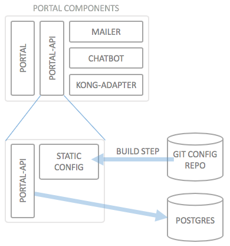

# Creating and Changing a Portal Configuration

## Introduction to "kickstarter"

In order to deploy your own API Portal with your own APIs, you will need a configuration repository. Configurations can either be edited directly using a text editor (and in some cases you will have to do that), or - which is preferred - using the "kickstarter".

The kickstarter is a web application which you run locally on your computer; it operates on a repository of configuration files, and is not intended to run publicly and/or constantly. It is just for editing the configuration.

## What's in the configuration?

The following things (and some more) are part of the configuration of the API Portal:

* API Definitions
    * API Gateway configuration for each API
    * Backend end points for the APIs
* Plan definitions
* User Group definitions
* Initial Users definitions
* [Authorization Server Settings](authorization-servers.md)
    * [Auth Method Configuration](auth-methods.md)
    * Local signup configuration
    * ...
* Custom Content, such as Tutorials,...
* ...

Most of these things are not only configurable inside the configuration, but also parametrizable using so-called "environments". To read up more on environments, see [Using Deployment Environments](deployment-environments.md).

## How the configuration repository works

In order to make it clearer how the configuration of the API Portal, consider the following illustration which is a part of the [deployment architecture](deployment-architecture.md) of the API Portal:



This image illustrates that the Portal API component is actually made up of three different containers: The `portal-api` container, and two additional configuration/state containers (data only containers), of which one is the static configuration container, and the other contains the dynamic data (users/passwords, application definitions, API subscriptions) which are used at runtime.

The deployment process assumes the static configuration resides inside a git configuration repository, and the only thing it needs to build are the credentials and URLs of this git repository.

The configuration repository itself is what is used with the kickstarter. The kickstarter can edit those static configuration files.

# Creating a new configuration repository

The following steps assume you have **not** set up a development environment for API Portal development (the API Portal components themselves), but rather are using the pre-packaged docker images Haufe-Lexware have created from the sources.

### Step 1: Installing the `wicked-cli`

Follow the instructions on [wicked-in-a-box](wicked-in-a-box.md) to install the wicked command line tool. The CLI is the easiest way to get started with creating a wicked configuration.

### Step 2: Create an empty repository directory

On your local machine, create an empty directory `<repo>` at the location you want to store the repository configuration locally.

**Note**: We will mount this directory into the `docker` image for kickstarter, so this has to be technically possible. Depending on the `docker` type you are using, you will want to stick to a subdirectory of your user folder (`C:\Documents\<your user>` on Windows, `/Users/<your user>` on Mac OS X). This path will be referred to as `/path/to/repo` in the following sections.

**Note for Windows**: As of docker 1.12, you will need to grant access to Docker to the drive you want to use for your configuration repository. When docker is running, right click the task bar icon, select "Settings...", then "Shared Drives" and tick the corresponding check box (see also [issue #8](https://github.com/Haufe-Lexware/wicked.haufe.io/issues/8)). For Windows users with a work or school account, the following workaround may be necessary: 

### Step 3: Running the kickstarter

We are now ready to start the kickstarter:

```
$ wicked kickstart /path/to/repo --new
```

The above command does the following things:

* Starts the kickstarter image (and will remove it after it has finished)
* Mounts `/path/to/repo` (your new repository configuration directory) into the Kickstarter container
* Opens the port `3333`
* Tells kickstarter to create a new configuration (`--new`)
* **Linux**: The wicked CLI will attempt to detect your local user's UID and GID and run the Kickstarter process inside the container with these IDs, so that the created files will belong to your local user on the local machine's disk

Depending on your docker setup, you may now browse to [http://localhost:3333](http://localhost:3333) and view the kickstarters configuration pages.

### Step 4: Inspecting the repository

Inside the `/path/to/repo` directory, kickstarter has now put quite a large amount of files which can be used for deploying an API Portal to your premises. 

The most part of these files reside inside the `static` directory and can be directly committed to a git repository, but there is a special file which was created which needs special attention: `deploy.envkey`. This file contains a random string which is used to encrypt secrets inside the configuration files. This file **MUST NEVER BE CHECKED IN TO VERSION CONTROL**. This is the key which you need on your deployment system ([CI/CD system](continuous-deployment.md)) in order to "unlock" the encrypted secrets inside your configuration.

By default, a `.gitignore` file is created which explicitly takes out the `deploy.envkey` from source control. Nonetheless, when you edit a configuration using the kickstarter, you will need this file to be in place. If it is not, a new one will be created, but previously created secret environment variables can not be successfullly decrypted. For a more thorough discussion on secret environment variables, see [Using Deployment Environments](deployment-environments.md) and [Handling Credentials](handling-credentials.md).

### Step 5: Stopping the kickstarter

Either press `Ctrl-C` in the terminal, or use the "Shut down" icon in the Kickstarter UI (on localhost:3333).

### Step 6: Checking in configuration to a git repository

Now you are ready to check in the configuration to a git repository. Please review your configuration settings, so that no credentials are checked in as clear text into the git repository. In case you need to keep credentials in the configuration, such as client ids and secrets for Google or Github social logins, please confer to the documentation on [handling credentials](handling-credentials.md).

Note down the git repository and credentials needed to clone the repository; these are needed when deploying.

### Conclusion

We have now created a new initial configuration for an API Portal; all the files are stored locally in `/path/to/repo`, and should now be stored inside a git repository.

### Next steps

* [Deploying the API Portal locally](deploying-locally.md)
* [Deploying to production](deploying-to-production.md)
* [Specifying deployment environments](deployment-environments.md)

<a name='editing'>&nbsp;</a>
# Editing a configuration repository

## Prerequisites

In order to change an existing configuration, you will need the following things:

* The git repository and corresponding credentials,
* The encryption key which was used when the repository was created

The encryption is normally called `deploy.envkey` and is automatically created when a repository is created. As this key **MUST NEVER** be checked in to git, you will have to keep track of it with some other kind of mechanism (which is not covered here). It is to be treated as a password for the entire repository.

In case you have stored the encryption key somewhere else, you will need to create a new file called `deploy.envkey` containing the encryption key; please take care that the file does not contain any kinds of line breaks (#10 or #13).

Then clone the repository, the path to the configuration repository will be referred to as `/path/to/repo`. The `deploy.envkey` file has to reside inside the `static` directory (besides the `globals.json` file).

### Step 1: Specify the kickstarter docker tag

Use the following command to set the Kickstarter tag to use:

```
$ wicked tags set <tag>
```

More information can be found at [wicked-in-a-box](wicked-in-a-box.md).

**Note**: It's important that you are using the same version of the kickstarter as the API Portal you will be deploying. The different components are released together and rely on each other using the same data formats. In case you are using a named release (tagged) of the API Portal for deployment, you **MUST** use the same version for the kickstarter. Otherwise, the static configuration will potentially have a higher version number than the API Portal can actually handle. This may result in unpredictable behavior of the Portal, and/or the portal will not be able to start correctly.

### Step 2: Start the kickstarter

With the `/path/to/repo` at your cloned repository, issue the following command:

```
$ wicked kickstart /path/to/repo
```

It is essentially the same command line as when creating a new configuration, just omitting `--new`. The kickstarter in docker will assume that the static configuration resides in `/var/portal-api/static`, which will be the case if you mount your `/path/to/repo` to that path inside the container with the above `-v` command line switch.

**Linux users:** The Kickstarter will attempt to read and write using the `uid` and `gid` of your local Linux user.

### Step 3: Edit the configuration

The kickstarter will now run and you can access the configuration web site at [http://localhost:3333](http://localhost:3333).

Most options in the kickstater UI are self-explanatory, and/or are documented inside the web site itself.

Some things you may want to do which are explained in more detail here:

* [Defining an API](defining-an-api.md)
* [Setting up API Plans](setting-up-plans.md)
* [Defining user groups](defining-user-groups.md)
* [Adding custom content](adding-custom-content.md)

### Step 4: Stop the kickstarter

As soon as you are done editing the configuration, shut down the kickstarter using the "shutdown" icon top right of each configuration page. Alternatively, you can press `Ctrl-C` to shut down the Kickstarter process. The wicked CLI will detect the keypress and shut down the container.

Due to mounting in your local directory into the container, the configuration will now have changed on your local disk.

### Step 5: Check in your configuration changes

When you are done with editing the configuration and have stopped the kickstarter, you can continue with checking in the configuration to your git repository. Review the changes with the following things especially in mind:

* Are there any new credentials/secrets which are visible in plain text? (see [handling credentials](handling-credentials.md)
* Are there settings which have to change between different deployment environments, and thus need to be parametrized using [environment variables](deployment-environments.md)?

### Step 6: Reload the Configuration

In order to get the configuration changes propagated to the running wicked instance, the API container(s) of wicked need(s) to be restarted. At each restart, the configuration is cloned from git automatically, and thus the latest changes are pulled. The only case where this does not apply is when using specific git revisions passed on via e.g. the [Helm template (for deployments in Kubernetes)](../wicked).

In other cases, you can trigger a restart of the `wicked.api` container using one of the following methods:

* Use the "System Health" page's "Reload Configuration" button (recommended)
* Trigger a restart/kill the `wicked.api` container, e.g. by issuing a `kubectl delete pod` command on the right pod
* Redeploy the entire stack using a script (may lead to unnecessary downtime)

