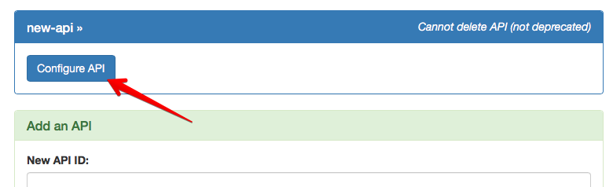
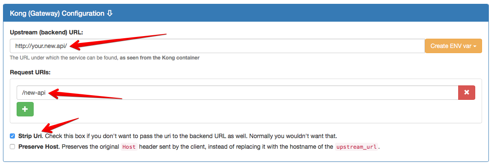

# Defining an API

## Prerequisites

* You have [created a portal configuration](creating-a-portal-configuration.md) repository
* You know which backend URL you want to pass through the API Gateway (upstream service URL)
* The kickstarter is running, pointing to your configuration repository

## API Definition

Defining an API consists of providing information on the following things:

* API name and descriptions
* Authentication method (`key-auth` or `oauth2` currently)
* Required [user group](defining-user-groups.md)
* API backend URL
* [Subscription plans attached to the API](setting-up-plans.md)
* The API Swagger file
* The API Gateway (Kong) configuration
    * The request path (under which URL shall the API be reached)
    * Backend URL (the actual service URL)
    * Gateway configuration (rate limiting, CORS,...)

### Step 1: Creating a new API

In the kickstarter, navigate to the [APIs Page](http://localhost:3333/apis). In the green panel at the bottom of the page, specify the ID of the API to create. This has to be a combination of lower case letters, numbers and hyphens. The kickstarter will not allow the creation of other APIs.

After specifying the API ID, click "Add API &raquo;"; the page will reload and display the new API at the bottom of the page. Click the title of the API to display the button to display the configuration for the specific API:

Specify:

* **API Name**: This is the short friendly name of the API; this is displayed to the user
* **Short Description**: The short description is displayed on the API Index page of your API Portal, in addition to the above name.
* **Authorization Mode**: Specify either `key-auth` for authentication via http headers or `oauth2` for API authentication using some OAuth 2.0 Flow.
* **Required User Group**: In case you specify a required user group, only users which belong to this [user group](defining-user-groups.md) will be able to even *see* the API in the API Portal.
* **Subscription Plans**: Tick the subscription plans you want to be available for this API. **Note**: DO NOT REMOVE PLANS AFTER YOU HAVE DEPLOYED THIS API. Removing API Plans which have active subscriptions will result in undefined behaviour of the API Portal. For a discussion of API Plans, see [setting up plans](setting-up-plans.md).

You can click**Save** at the top of the page anytime to save your changes. You will remain on the page.

### Step 2: Kong Configuration

The next configuration part is the actual configuration of the API Gateway, which is Mashape Kong. In order to do this, go to the "Kong (Gateway) Configuration" panel:

#### Basic Configuration

The basic configuration tells Kong where to actually find the backend service and under which request path on the API Host the API shall be reached.

* **Upstream (backend) URL**: The fully qualified URL to your actual backend service which the API Gateway proxies to. If the service starts at a specific URL prefix, you will need to add this here, too. Example: `http://server.company.com/service/v2/endpoint`.
    * If you have more than one deployment environment, you can choose to use an environment variable for this setting. See also [deployment environments](deployment-environments.md).
* **Request path**: This is the path on the API Host under which your API will be reachable. Example: `/service/v2`. Can contain multiple paths, if you have a use case for that.

**Example**: Assuming you have specified the [DNS name of the API Host](deployment-architecture.md) to be `api.company.com`, and the settings otherwise as above (backend URL `http://server.company.com/service/v2/endpoint` and request path `service/v2`), then the following happens (with **Strip Request Path** checked): Calling `https://api.company.com/service/v2/users/123456` will proxy the call to the backend service at `http://server.company.com/service/v2/endpoint/users/123456`. In case you will not have checked the **Strip Request Path**, the backend URL called will be `http://server.company.com/service/v2/endpoint/service/v2/users/123456`. This may be useful for specific user cases, but normally you will check the **Strip Request Path** option.

#### Plugin Configuration

The API Gateway, i.e. [Mashape Kong](https://getkong.org), has a powerful plugin concept in place, which can also be used with the API Portal. Some of the [Plugins which Kong provides](https://getkong.org/plugins) can be configured conveniently using the kickstarter, some others do not (yet) have explicit support.

For APIs, the following plugins can be configured using the kickstarter:

* Rate Limiting
* CORS
* Adding `BasicAuth` authentication (towards the backend)
* Adding a `Forwarded` header

See [Configuring Kong Plugins](configuring-kong-plugins.md) for more informations.

In case you don't want to define a plugin for the entire API, you will need to look at the plugin configuration of [API Plans](setting-up-plans.md).

To edit the long description of the API, click the "API Long Description" button at the bottom of the API Panel.

### Step 3: Documentation

Even though it's not actually necessary to supply a Swagger file for your API, this is highly encouraged. After having saved (important) your changes in Step 1, you can now click the "Swagger file" button at the bottom of the API Panel.

This will open an editor for JSON; the editor is not really intended for actual editing, but you can use it to cut and paste the Swagger file from a different location into the API Portal configuration.

**Note**: It is advisable to set up continuous integration of Swagger files from your backend services into the configuration repository. In that case, you would not actually manually copy/paste the Swagger file into the configuration repository, but rather push it using CI/CD tooling. For further information on this topic, see [setting up continuous deployment](continuous-deployment.md).

