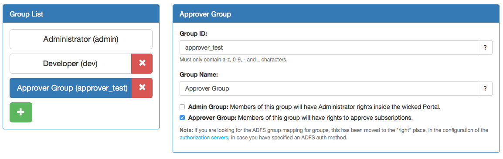
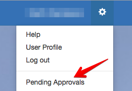

# Approver role for User Groups 

## Introduction 
The group feature now supports an approval role.  The approver role allows for controlling which users have the ability to approve API subscription requests.  
 
Approver role provides flexibility for use of the Wicked API portal across an enterprise, where there may be business or commercial need to segment who has the responsibility to take action on an API approval request. By introducing the approver group type, we are able to control who sees what API approval requests.  

## How it works 

### Configuring Groups to have approver role

The Groups Configuration Screen in Kickstarter has a checkbox which allows the user to assign a new group type called 'approver' as part of Group Definition. For example, we create a new group called 'Electric Car API Approver' and assign it as approver 
 _Note: **This change does not impact existing admin group functionality**._ 
 

### Associating APIs to approvers 

Approver needs to be part of the group that is associated with the API that he/she has the responsibility to approve, enabling the approver to see their approval requests when logging into the Wicked API Portal.  
For example, our gateway has an API, 'Charge Reader'.  To approver needs to be part of the  'Charge Reader' group to see approval requests for this API in the portal.

### API Portal UI 

The API portal menu for an approver includes a link to 'Pending Approvals' 

