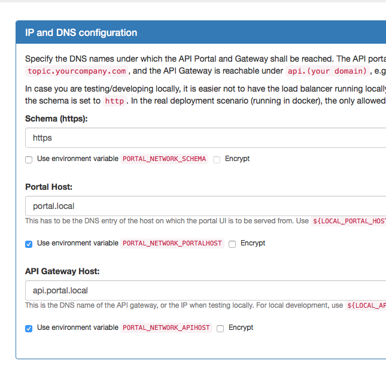
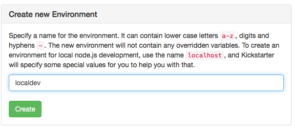
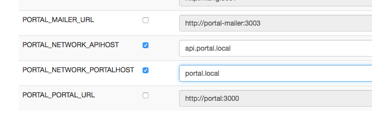
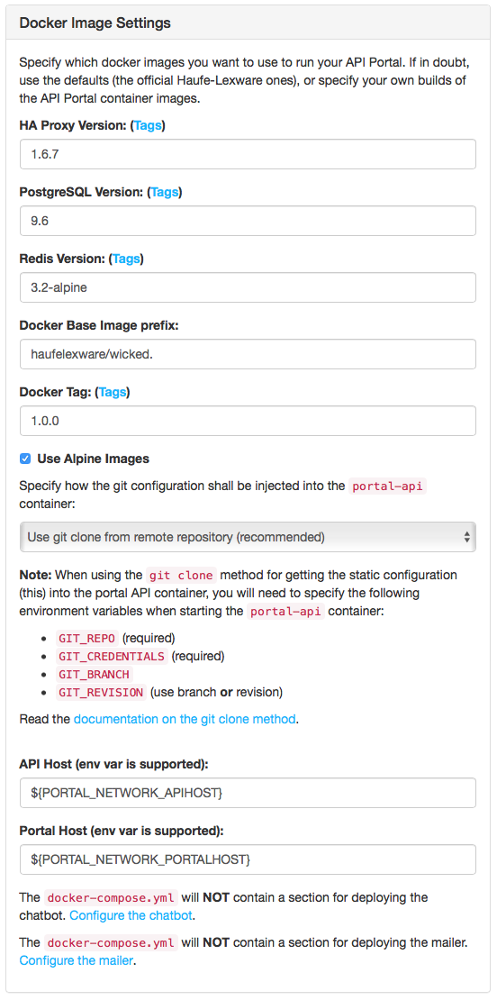

**IMPORTANT NOTE**: This documentation may be slightly outdated for wicked 1.0.0.

----

# Deploying to a single Docker Host

If you plan to run your API Management instance on a single docker host, or by leveraging a Docker Swarm using `docker-compose`, this guide is for you.

This document assumes that you already have a configuration repository (with a `static` directory in the root of the repository), see [creating a portal configuration](creating-a-portal-configuration.md), and that you are familiar with using the Kickstarter.

It is also assumed that you have Docker host certificates and keys for use with `docker-machine` so that you can talk to your docker host using the usual `docker` and `docker-compose` commands. This is not part of the guide.

# Initial Deployment

## Enable env vars for portal and API hosts

Enable using environment variables for the host names you want to deploy to. To do that, open up the [IP, DB and DNS page](http://localhost:3333/ipconfig) in the kickstarter. Click the two checkboxes depicting that:



Hit "Save" to save the configuration. Now you will be able to see that there are two new environment variables.

## Create a deployment environment

To keep the settings for [local development](deploying-locally.md) and the deployment to the docker host apart, you must create an environment. Throughout this document, this environment is called `prod`, but you are free to use whatever name you like, as long as it's not `localhost`. You may also create multiple environments, e.g. in case you have a `test` or `stage` environment in addition to a `prod` environment. Here, we will assume `prod`.

Within the kickstarter, go to the [Environments Page](http://localhost:3333/envs) and create a new Environment called `prod`:



Open up that environment and override the `PORTAL_NETWORK_APIHOST` and `PORTAL_NETWORK_PORTALHOST` environment variables:



Use correct values for the variables; these DNS names must be CNAMEs (or A-records, depending on your DNS setup) pointing to your docker host IP. In principle, these two variables can have any address you can control, as long as they point to the docker host, so that the HAproxy can route the VHOSTs correctly to the backends.

Note that these environment variables are kept inside the portal configuration; they do not need to be set from the "outside", they are extracted at runtime.

## Create a `docker-compose.yml` file

Go to the [Deployment Page](http://localhost:3333/deploy) in the Kickstarter; if you don't have a `docker-compose.yml` in your base configuration directory, it will look like this:



Hit the "Save" button, and one or two files will be created (default only `docker-compose.yml`):

* `docker-compose.yml`
* `static/Dockerfile` (optional, when using the `git clone` method, this is not created)

See also the [deployment architecture](deployment-architecture.md) for a picture of how the containers work together. 

In case you specified "Build data-only container", the `static/Dockerfile` is used to build the "Static Configuration Container".

Depending on which method of injecting the static configuration into the `portal-api` container you choose, the `static/Dockerfile` might not be used; as of wicked 0.11.0 the recommended way of deploying is the `git clone` method.

**Important**: Even if you already created a `docker-compose.yml`, you may want to recreate it again to benefit from the improved compose template.

### Choosing static configuration deployment method

* [The git clone method for injecting static configuration into the portal API](static-config-git-clone.md)
* [The data-only container method for injecting static configuration into the portal API](static-config-dataonly-container.md)

## Inject SSL certificates

At deployment of the API Portal compose file, you will also need valid SSL certificates for use in the HAproxy; these should match the domain names you specified above (or for internal deployments those can also be self-signed certificates, but this requries your clients to accept them explicitly).

Pass in the following two environment variables:

| Variable | Description |
| --- | --- |
| `GATEWAY_PEM` | The certificate and key for the API end point (`PORTAL_NETWORK_APIHOST`) |
| `PORTAL_PEM` | The certificate and key for the API Portal end point (`PORTAL_NETWORK_PORTALHOST`) |

The values of these variables must be in a special format for HAproxy to be able to extract them; from certificate and private key files, assemble them like this:

```bash
export GATEWAY_PEM=$(cat {{envName}}/gateway-key.pem {{envName}}/gateway-cert.pem | tr -d '\015' | awk 1 ORS='\\n')
export PORTAL_PEM=$(cat {{envName}}/portal-key.pem {{envName}}/portal-cert.pem | tr -d '\015' | awk 1 ORS='\\n')
```

## Deploy time environment variables (overview)

| Variable | Mandatory | Description |
| --- | --- | --- |
| `NODE_ENV` | yes | The environment name to start the API Portal in; e.g. `prod` |
| `PORTAL_CONFIG_KEY` | yes | The deployment key which was created at the [initial creation of your portal configuration](creating-a-portal-configuration.md) |
| `PORTAL_NETWORK_APIHOST` | yes | The domain name of the API Gateway host; this is needed to configure HAproxy in the right way (HA proxy cannot access the internal dictionary of environment variables) with the VHOST of the API Gateway |
| `PORTAL_NETWORK_PORTALHOST` | yes | Idem for the portal VHOST |
| `DEBUG` | - | Debugging parameters for use in the wicked core components. See [docker images](docker-images.md) for more information. |
| `GIT_REPO` | (yes) | The repository to get the static configuration from, e.g. `bitbucket.org/yourorg/apim.config.git`. Mandatory if you want to use the git clone method for injecting the static configuratin. |
| `GIT_CREDENTIALS` | - | The git credentials to use with the `GIT_REPO`, as `username:password`, possibly URI encoded in case the password contains difficult characters. If empty, a public repo is assumed. |
| `GIT_BRANCH` | - | The git branch to checkout. Mutually exclusive with `GIT_REVISION`. |
| `GIT_REVISION` | - | The exact SHA revision has to check out using git, has to be the "long" revision hash. Mutually exclusive with `GIT_BRANCH`. |  

# Use Cases

The CI/CD use cases now follow for the "Deploy to Docker Host" deployment method (see [continuous deployment](continuous-deployment.md)).

## Initial deployment

You are now set to do an initial deployment to your docker host, assuming that you have configured your shell using `docker-machine env` to make `docker` and `docker-compose` talk to your desired docker host:

#### When using the `git clone` method

```bash
docker-compose up -d
```

#### When using the data-only container method

```bash
docker-compose build
docker-compose up -d
```

## Updating the API Configuration

Updating the API configuration is just a matter of getting a new version of the static configuration into the portal API container.

See also [updating the git configuration](updating-git-configuration.md).

#### When using the `git clone` method

If you just need a manual refresh of the configuration, you can log in as an administrator, view the "System Health" page and use the "Reload Configuration" button from there.

In case you want to automate the reloading of the configuration, proceed as follows:

Depending on whether you want to use a specific `GIT_REVISION` or not, set that environment variable. Otherwise `HEAD` of the selected branch (using `GIT_BRANCH`, or `master` if left out) is used:

```bash
docker-compose up -d --force-recreate portal-api
```

Please note that this will lead to a slight downtime for the portal API, and as a consequence of all dependant containers. These will detect that the configuration has changed and will restart themselves. This will usually not be noticeable, but there is a slight downtime (which currently can **not** be avoided).

#### When using the data-only container method

Assuming the `Dockerfile` is in the `static` directory and the default deployment `docker-compose.yml` file is used, proceed as follows:

```
docker-compose stop portal-api
docker-compose rm portal-api portal-api-data-static
docker-compose build portal-api-data-static
docker-compose up -d
```

This first destroys the `portal-api` and `portal-api-data-static` containers and subsequently rebuilds and deploys them again. This approach has a longer downtime than the above one (depending on hardware 30-60 seconds) due to the destruction of the `portal-api` container.

## Updating the wicked Core components

All wicked components always need to be deployed in the same version, so it is highly advisable to deploy them all in one go (otherwise they will refuse to run together).

This part does not differ between the two methods of injecting the static configuration.

**Always pay attention to the [release notes](release-notes.md) when updating the wicked core Components.** 

### Edit the `docker-compose.yml` to use the new version

Open up your `docker-compose.yml` file and change the image tags of the wicked components: `portal-api`, `portal`, `portal-kong-adapter`, `portal-mailer`, `portal-chatbot` and `kong`. Choose the tag you want to use. **Always use the same tag for all components!** The only exception to this is when explicitly stated that it's not needed in the release notes (this may be the case for the `kong` service).

### Deploy the new version

```
docker-compose pull
docker-compose up -d --force-recreate
```

This will create a short downtime (around a minute), so you may want to do this at a time where not many users are using your API Management Portal or Gateway(!).

## Updating Kong API Gateway

In this scenario, the Kong Gateway is treated same as the wicked Core Components, so see above.

## Updating the Postgres Database

Currently, there are no plans on moving away from the `postgres:9.6` image. This image may be updated once in a while, so doing a `docker-compose pull` from time to time may be advisable, but otherwise there is currently no need to upgrade the Postgres image; it's stable and very mature.

If in the future Kong will need a later version of Postgres, this will be described in the release notes when it's time.

# Docker Q & A

## Tips and tricks on transferring docker certificates

A surprisingly tedious task to solve when working with docker hosts is how to make your build server or CI/CD tooling be able to work with a specific docker host. This will most probably be something more and more tools will be able to support in a better way in the future, but in the meantime this has to be solved manually for most systems (such as Jenkins or GoCD).

We have mostly solved it in the following way:

* When creating a docker host using `docker-machine`, a folder `~/.docker/machine` is created containing the server certificates and all such
* Copy this folder to a temporary work folder
* **Optional**: Remove all machines folders from `.docker/machine/machines` you do not need on the build server
* **Optional**: In case you have a `.docker/machine/cache` folder (containing a `boot2docker.iso`), you can safely remove this as well, it's wasted space
* Open up the `.docker/machine/machines/<yourmachine>/config.json` file in a text editor
* Make all file paths start with `.docker/machine` instead of having the full path in the file names
* `tar cvfz docker-machine.tgz .docker`

Now you have a `docker-machine.tgz` archive you can use on your build server:

* In your configuration repository/the directory containing the `docker-compose.yml`
* `tar xvfz docker-machine.tgz`
* `eval $(docker-machine -s .docker/machine env <yourmachine>)`
* Docker now talks to your docker machine, as long as you remain in the **current working directory**; otherwise docker will not be able to resolve the needed certificates (as they are relative)

### Encrypting and decrypting the certificates

To take automation a step further, you may also check in the `docker-machine.tgz` to source control, together with the shell script to extract it, and deploy your configuration. Prior to doing this, we usually encrypt the `docker-machine.tgz` using `openssl`, with the `PORTAL_CONFIG_KEY` as a key.

Encrypting and decrypting the tar archive can be done like this (or using any other encryption method):

```bash
# encrypting
openssl enc -e -aes-256-cbc -k ${PORTAL_CONFIG_KEY} -in docker-machine.tgz -out docker-machine.tgz.enc
# decrypting
openssl enc -d -aes-256-cbc -k ${PORTAL_CONFIG_KEY} -in docker-machine.tgz.enc -out docker-machine.tgz
```

Storing an unencrypted certificate archive in source control is probably a bad idea. If you have other means of storing secrets, such as Hashicorp Vault or similar, that is most surely an even better possibility.
