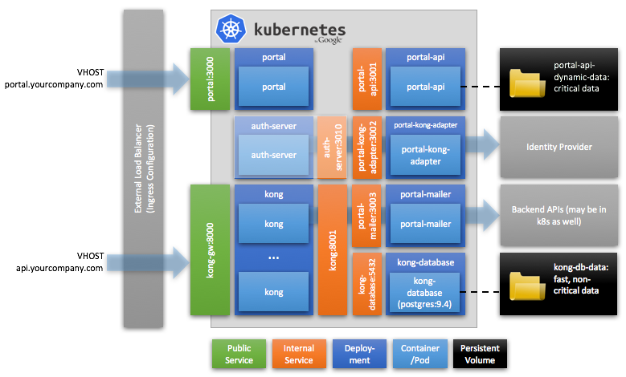

# Deploying wicked to Kubernetes

The API Portal and Gateway are suitable for deployment to [Kubernetes (k8s)](https://kubernetes.io). In this repository we have gathered some deployment scripts and configuration YMLs which can be used as a template for creating your own deployment pipelines to deploy wicked.haufe.io to your own Kubernetes cluster.

The documentation here does **not** contain guidance on how to set up a Kubernetes cluster; there are a lot of resources on the web which can guide you with that. This documentation only considers how you deploy wicked onto an already running Kubernetes cluster.

If you are impatient and just want to get going with Kubernetes, see here:

* [Deploying wicked to Kubernetes](kubernetes/deploy)
* [Updating a running wicked configuration](kubernetes/update)

When using Kubernetes, we **strongly suggest** you use explicit wicked versions (like 0.11.3) to make updates explicit. The Kong adapter has an explicit tie to the Kong version, and thus Kong has to match the Adapter.

## Deployment Architecture on Kubernetes

The following section describes the deployment architecture the sample deployment script builds up on k8s. This can be considered to be a suggestion or template, but some things will need to be adapted to fit your own infrastructure (especially concerning persistent storage).

Depending on the infrastructure you run on you will have to adapt either the ingress configuration, and/or not use the ingress configuration and configure the `kong-gw` and `portal` services as `NodePort` services which you in turn publish via your own load balancer structure. Please note that your load balancer needs to take care of SNI and TLS termination in that case, which is currently supposed to be taken care of by your configured ingress controller.

### Alternatives and Possible Changes

#### Postgres as a Service

If you're e.g. on AWS, you may want to consider switching out the Postgres instance to using a Postgres service, e.g. [Amazon RDS for Postgres](https://aws.amazon.com/de/rds/postgresql/). This would mean that you need to point your Kong instances to the end point of your Postgres Service.

Please consider also using a redis cache for storing rate limiting data in case you use Postgres as a Service, for latency reasons. Please read more on how to do this in the Kong documentation (PRs gladly accepted here).

#### Using Cassandra instead of Postgres

You can also use Cassandra as a storage for Kong. Either using a containerized version of Cassandra, or using it as a service (e.g. from InstaClustr). When using Cassandra in conjunction with Rate Limiting it's again advisable to look into using a redis instance to store the rate limiting runtime data, and to run that redis instance near the Kong instances.

#### Leaving out Mailer and/or Chatbot

In case you do not need the Mailer or Chatbot, feel free to just leave out the Deployments and Services for these. The portal will behave accordingly.
