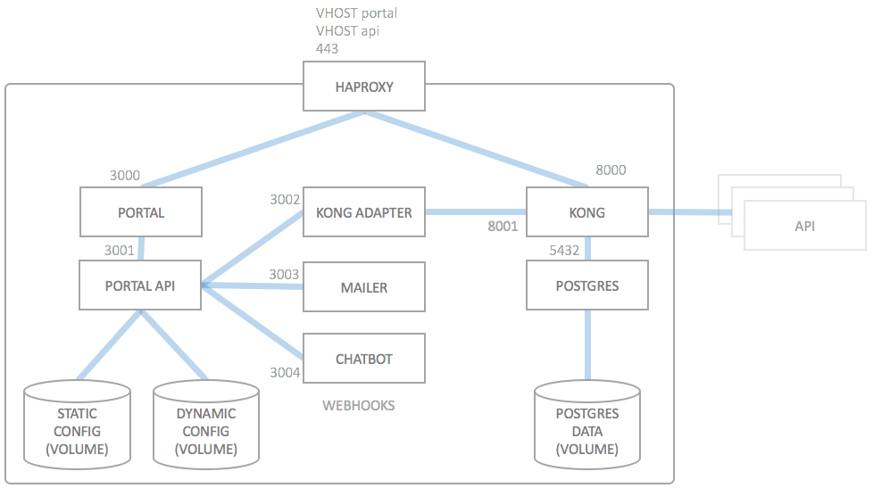

# Deployment Architecture

## Introduction

The API Portal is intended to be deployed to using Docker. The default configuration is suitable for deployment to a single Docker Host (or Docker Swarm) using `docker-compose`. For Kubernetes, the installation via the [wicked Helm Chart](deploying-to-kubernetes.md) is recommended. Alternatives are: [Docker Swarm](deploying-to-swarm.md), [Apache Mesos](deploying-to-mesos.md) and other orchestration layers supporting running Docker Containers.

The deployment architecture is usually as follows:

The next sections briefly describes the functionality of each deployment artifact. For a list of which docker images are begind the different boxes, please refer to the [docker images](docker-images.md) documentation.

### Load Balancer

A Load Balancer is needed to route traffic from the virtual hosts to either the portal UI or to Kong. The Load Balancer is in the docker case usually a HAproxy, but can be any type of load balancer (nginx, traefik, Kubernetes ingress controller) which suits your need.

Depending on your deployment setup, the load balancer is a HAproxy, or some other type of load balancer, e.g. an Elastic Load Balancer on AWS, an Azure Load Balancer, or an ingress controller on Kubernetes. It just has to fulfill the same requirements as the HAproxy, i.e. to do SSL termination and route the two VHOSTs to the backends.

### Portal

The PORTAL component consists of the actual web frontend of the API Portal. It is a stateless component (disregarding session information) which in turn relies completely on the PORTAL API to work correctly.

The PORTAL component is a node.js service listening on port 3000 over `http`, on the internal IP address `portal`.

### Portal API

The PORTAL API is the heart of the API Portal. It is effectively the only component which has state (albeit placed in a data only container, DYNAMIC CONFIG). The PORTAL API is reachable within the docker network as `portal-api` with the `http` protocol on port `3001`  and serves a REST interface on which all other components which are connected to PORTAL API rely on: PORTAL, KONG ADAPTER, MAILER and CHATBOT.

PORTAL API is implemented completely in node.js.

#### Static Config

The base for each deployment is the static configuration. The static configuration is usually stored inside a git repository on your premises, and is cloned into the portal API container at container startup (at every startup). This is done by supplying both a `GIT_REPO` and `GIT_CREDENTIALS` to the portal API container (and optionally a `GIT_BRANCH`) so that it can clone the configuration from there.

Alternatively (to the git repository), the STATIC CONFIG can be created at deployment time by building a static configuration container directly on the docker host which is to host the API Portal. This is usually done by keeping a special `Dockerfile` inside the deployment repository, which in turn clones the configuration repository into this container.

The data inside STATIC CONFIG is static and will not change over time once the API Portal has been started after a deployment. STATIC CONFIG is a "data only" container which does not actually run, but only exposes a data volume which is mounted by the PORTAL API container at runtime. When redeploying, this container always has to be destroyed and rebuilt, if you choose the data-only volume approach. In case you choose the git clone approach, recreating the portal API container is enough to retrieve the new version of the configuration.

### Postgres

All data from both wicked and Kong are stored inside a Postgres database. The recommended way (currently) is to use one Postgres instance for both wicked and for Kong, as Kong and wicked have data which needs to be in sync.

Wicked and Kong use two different internal Postgres databases (`kong` and `wicked`, respectively) so that the data can both be backed up and restored independently from each other, if need be.

The postgres contains all dynamic (non-static) data which is needed for the API Portal, such as

* Users and Registrations
* Applications
* API Subscriptions
* Email and Password verifications

When deploying wicked, it is recommended to use a separate Postgres deployment, which is not part of wicked. Wicked usually providers a means of also deploying postgres (in a container), but this method is not recommended for production (there you should use a professionally run Postgres). This is also the reason why Postgres is depicted as laying outside the actual wicked components.

**IMPORTANT**: As of wicked 1.0.0, the data is NO LONGER stored as plain JSON files in a data only container of the portal API container. Everything is persisted in Postgres, and thus the Postgres instance is now MUCH MORE important than it was in wicked <1.0.0.

### Kong Adapter

The KONG ADAPTER is implemented as a node.js service which hooks into the webhook interface of the PORTAL API. It uses the address `portal-kong-adapter` and listens on port `3002`. The Kong adapter listens to events from the PORTAL API and translates these into actions on the admininstration REST API of the Kong instance. The KONG ADAPTER fulfills the REST API specification for webhook listeners.

### Mailer

The MAILER component is also a webhook listener implementation, but this component listens to specific events and sends out emails on certain (configurable) events, e.g. when a user has just registered and needs to verify his/her email address, or if a password was lost. It's also implemented in node.js, it listens on address `portal-mailer` on port `3003`, using the `http` protocol.

### Chatbot

The CHATBOT component is very similar to the MAILER component, but does not send mails. Instead it may (configurably so) send out messages to webhook sinks in Slack or RocketChat (or other compatible chat tools). It has the default address `portal-chatbot` on port `3004`.

### Auth Server

The AUTH SERVER component is responsible for establishing user identity before allowing access (by creating access and possibly refresh tokens) to an API, also including the portal API. It is an actual implementation of a full featured OAuth 2.0 authorization server as specified in the [RFC 6749 for OAuth 2.0](https://tools.ietf.org/html/rfc6749).

### Kong

If PORTAL API is the heart of the API Portal, Kong is the absolute heart of the API Gateway. The KONG component is based (very directly) on Mashape Kong, and routes all traffic according to the configuration in STATIC CONFIG and DYNAMIC CONFIG (via PORTAL API and KONG ADAPTER) to the backend APIs, or restricts access to the APIs. For storage of certain runtime data (such as rate limiting), it uses a database, here POSTGRES.

## Deployment Variants

The above deployment architecture will most probably work for most scenarios, but there may be a need for other types of deployments in the future. This is not impossible at all, but rather expected. The API Portal is designed upfront to be able to deployed using other architectures.
