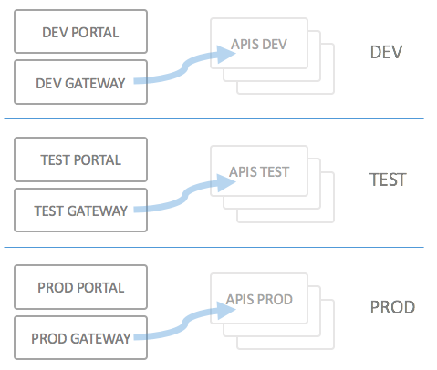
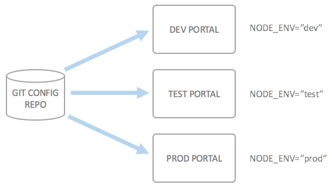
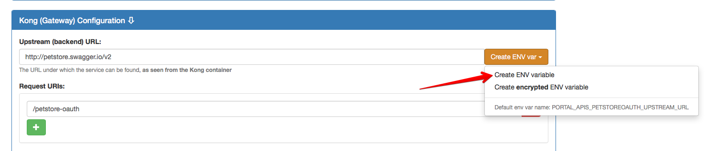
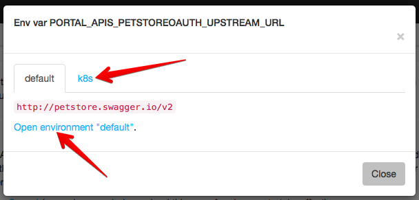

# Using Deployment Environments

## Introduction

For most larger deployments of an API Portal, you will not only have a single deployment of the portal, but rather multiple ones. At least this is how the API Portal is built up and is intended to be used. Depending on how you set up [continuous deployment](continuous-deployment.md) for your API Portal, your mileage may vary, but the main ideas should be the same.

This is a typical deployment scenario spanning three different environments of the API Portal and the services behind:

Obviously, the configuration of the API Portal and API Gateway depends on the deployment environments; typical things which differ between the portals and gateways are (but are not limited to):

* Backend URLs (URIs to the API implementations)
* DNS entries for API Portal and Gateway
* Callback URLs for login federation (ADFS, Google and Github configuration)

## Support for environments

To help with these things, the API Portal supports the notion of "Environments", which are in effect only a packaging mechanism for a set of environment variables at runtime of the portal.

The idea is to get the following picture of the deployments (here, "API Portal" includes all the components, i.e. both the portal and the gateway):

An example will make it simpler to understand how it works. Start up the [kickstarter](creating-a-portal-configuration.md) with your own configuration, and perform the following step to introduce a new environment.

### Parametrizing a backend URL

* Open the [APIs page](http://localhost:3333/apis) and select an API you want to parametrize the backend URL for.
* Open the "Kong Configuration" of the API, locate the "Upstream URL" click the "Create ENV var" button:

* Save the configuration and head over to the [Environments](http://localhost:3333/envs) page.
* On the `/envs` page, you will see a single environment `default`; [click the default link](http://localhost:3333/envs/default).
* Among other settings, you will find the new environment variable here.

You can also inspect the content of the environment variable by using the "Show ENV var" button which is displayed if the content of the field starts with a dollar sign `$`:

Now you have the choice to either just override this environment variable when deploying/running the portal (which will work just fine), or you can create environments which specify override variables. To do this, go back to the `/envs` page, and click the "Create new Environment" title bar.

* Specify a new environment name, such as `dev`, and click "Create"
* A page with the new environment and all environment variables is display; by default, all the variables are set to be inherited from the `default` environment
* Locate the new `PORTAL_APIS_<YOURAPI>_UPSTREAM_URL` variable, and click the "Override" check box.
* Enter a different value for the backend URL

In case you want to, you may now repeat for all your different environments.

### What happens in the configuration

Inside your configuration repository, each creation of an environment has two effects:

* A new entry is added to the meta information file `kickstarter.json`; this file is used to keep track of the configuration files in the kickstarter (it is not used at API Portal runtime)
* A new file `<your_new_env>.json` is created in the `static/env/` directory. This file contains all the overridden variables. The `default.json` which contains all environment variables is also stored in this directory.

## Selecting an environment at runtime

In order to select which configuration environment should be used at runtime, the API Portal listens to the environment variable `NODE_ENV`; the `NODE_ENV` must match one of the defined environments from above.

How a deployment works is described in more detail on the following pages:

* [Deploying Locally](deploying-locally.md)
* [Deploying to Production](deploying-to-production.md)

## Tips and tricks

* In most places where it's possible to use an environment variable instead of the "real" value, it's possible to just replace a part of the string with an environment variable, such as `"This is the ${PORTAL_TITLE}'s authorization server"`, or (more useful) in URLs: `https://${PORTAL_NETWORK_APIHOST}/auth-server`. This way you may re-use URL parts or other things.
* If you introduce an environment variable manually (anywhere in any JSON file almost), you will just have to re-load the `default` "Environment" page for the Kickstarter to pick up the variable; this is especially useful when e.g. configuring custom plugins or authorization server settings

# Using a `localhost` environment for local testing

See [development environemt](development-environment.md) for more information on how to set up a local development environment for local testing.
