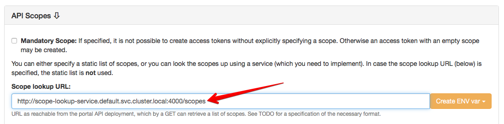
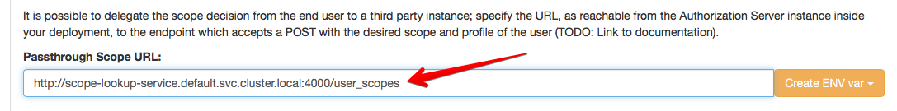

# Dynamic API scopes

Under certain circumstances, it's necessary to have API scopes decided not by the end user, but by the actual Resource Owner. Some use cases of scopes make use of scopes for handling licenses (e.g. for content products), where the presence of a scope bound to the token is a sign of a purchased/existing license. In those cases, the "Resource Owner" of the API is not actually the end user, but the operator of the API, and thus the scopes are decided upon by some piece of software (with a custom business logic).

This has the following main implications:

* It's not the user which has the right to decide on the scope of the API request, but some custom code
* There must exist an interface for wicked to "ask" another piece of software for the necessary scopes
* As Kong needs to know all possible scopes beforehand, there must also exist an interface for asking a different piece of software for all possible scopes (e.g. licenses)

## Step 1: Getting scopes from a service (optional)

This step is optional - if you have a static set of scopes, just enter them using the Kickstarter. If you have a dynamically changing scopes (e.g. new license ids are added or similar), you will want to perform this step as well.

Implement a small service, or extend an existing one to expose a `/scopes/:apiId` end point. Deploy this service in a way that it's accessible for the wicked Portal API component (in the same virtual network, or similar) without any type of authentication. Then, using the Kickstarter, specify the URL of the service in the API configuration:



Wicked will append a `/` if not already present, and then perform a `GET` on the `<URL>/<api ID>` end point, e.g. for the API `content`, wicked would `GET http://scope-lookup-service.default.svc.cluster.local:4000/scopes/content`. Wicked assumes that the response is formed like this:

```
Content-Type: application/json

{
    "scope1": { 
        "description": "This is scope 1"
    },
    "scope2": {
        "description": "This is another scope"
    }
}
```

Every five minutes, wicked will perform this lookup again; it will take up to another five minutes until the settings have actually propagated to Kong, so allow wicked this time before you actually start serving new scopes.

## Step 2: Dynamically looking up scopes for a user

The second step is the more interesting case: After a user has been successfully authenticated by the Authorization Server (and the [configured auth method](auth-methods.md)), wicked can delegate the finding of the correct scope to a third party service. This can be the same service (with a different end point) as above, or a completely different one.

Implement an end point "user scope", which needs to be specific to the API and configure it in the Kickstarter for a specific API as the "Passthrough Scope URL":



After authenticating a user, the Authorization Server will now perform a `POST` to this end point and expects to get a list of scopes back. The Authorization Server will post the Open ID Connect compliant **profile** of the user to the end point.

**Example**:

```
POST http://scope-lookup-service.default.svc.cluster.local:4000/user_scopes

{
  "sub": "<idp unique id>",
  "email": "<user email>",
  "email_verified": <true|false>,
  "name: "Display Name"
  // ... other properties
}
```

The `sub` contains a string which is formatted in the following way:

```
sub=<auth method id>:<unique id of idp>
```

In case e.g. of a Google authentication, such a string may look like this: `sub=google:<some google id>`.

Wicked's Authorization Server then expects a response in the following way:

```
Content-Type: application/json

{
  "allow": <true|false>, // Mandatory
  "authenticated_scope": ["scope1", "scope2", "..."], // Mandatory
  "authenticated_userid": "<optional override>" // Optional
}
```

The response must be a JSON structure containing a boolean property `allow` and a property `authenticated_scope` which contains an array of allowed scopes.

This end point will also be called should the API client decide to attempt to refresh the token. In those cases, only the `sub` property of the POST message is supplied, as the other values are not present in any database to that point in time.

In case `allow` is set to `false`, the Authorization Server will reject the authorization request to the calling client with an appropriate error message. This will also happen in case the service which looks up the scopes is not reachable.

The property `authenticated_userid` is an optional response parameter which can be used to override the user id in the passed in `sub` property.

## Addendum: Configure "Passthrough Users"

When using the "Passthrough Scope URL", it's usually advisable to also make use of "Passthrough Users", as wicked does not need to actually store any type of information on the user anyway.

See [Passthrough Users](passthrough-users.md) for more information.
