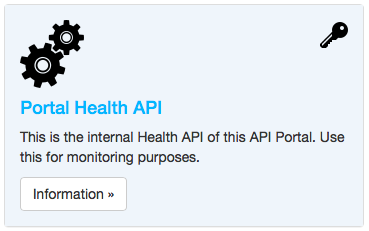

# Monitoring the API Portal

An deployment such as an API Portal should always be monitored in some way, both regarding the underlying APIs, and the API Portal itself. Let us look at the two categories of monitoring which are of immediate importance.

#### API Monitoring for the backend APIs

To make sure the API Gateway works like it should, it is recommended to have certain "ping" endpoints on your backend APIs which can be used from a monitoring application to check whether access is possible via the API gateway to the backend API.

These endpoints do usually not need to be very elaborate (return `OK` or similar); they should just enable your monitoring application to rule out the API Gateway if something is not reachable from the outside.

#### API Portal Monitoring

Likewise, the API Portal itself also should be monitored. The API Portal provides a "Health API" to make this task easier.

## Setting up monitoring

Setting up monitoring is fairly straightforward, using the mechanisms of the API Portal itself. You only need to log in to the API Portal as an user which is part of the `admin` group; this will give you access to the "Health API", which is a built-in API of the API Portal. Perform the following steps (logged in as an Admin user):

* Register an application which corresponds to your monitoring application, such as "Nagios" or similar
* Subscribe to the "Health API" (API ID `portal-health`) for this application
* Optionally also subscribe to all other APIs which are to be monitored by this application
* Use the API Keys or Client Credentials to set up monitoring

The [description of the Health API](https://github.com/Haufe-Lexware/wicked.portal-api/blob/master/routes/internal_apis/portal-health/desc.md) also contains more information on this topic.
