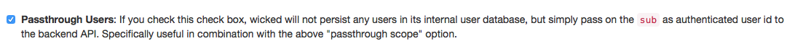

# API Passthrough users

In some cases it's not necessary for wicked to store any user information, as the users are not able to store any application grants anyway. For such situations, the check box "Passthrough Users" of an API can be used:

As stated in the Kickstarter, this means that users are never persisted in the wicked database, but their unique IDs (whatever is mapped to `sub`, depending on the Auth Method) are merely passed on in the `X-Authenticated-UserId` header as `<unique id>`. This can be useful not only for passthrough scopes, but also if you just want to make sure that a user can be authenticated via some identity provider, but it doesn't matter which scope is used (or no scopes are used).

**Note**: This option cannot be used in conjunction with user registrations - user registrations require persisting the users in the wicked user database.
