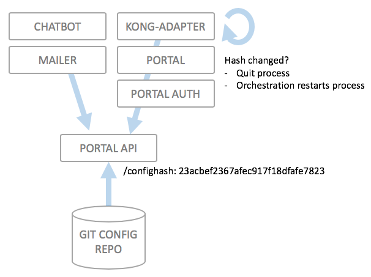

# Updating the static configuration of a running system

**IMPORTANT NOTE**: This guide assumes the following:

* Wicked 1.0.0+ installation
* Postgres storage

One of the most common use cases is to update the static configuration (stored in a git repository) of a running wicked installation. How this can be achieved is currently depending on the deployment method which was used to deploy wicked.

#### WORK IN PROGRESS

This document is work in progress and is subject to change over the next versions; the target is the following:

* Enable automatic detection of git repository changes
* Automatic zero downtime updates of the static configuration

This is currently **not the case**. Updating the static configuration incurs a short downtime of around a minute, as components restart.

## Basic Work mode of wicked

This image illustrates how wicked acts to keep the configuration throughout its component up to date:

The portal API, which is the component which keeps the static configuration in its process, calculates a hash value of the static configuration. This hash value is exposed as an REST endpoint `/confighash` which is checked regularly by all other components, in this case the portal itself, the authorization server, the kong adapter, the chatbot and the mailer (if deployed). If the hash has changed, the components will schedule a process termination; they rely on the container orchestration layer to restart them, at which point they will reload the configuration from the portal API.

This means that there is a short period of time where the containers are not responding (as they are currently restarting). All in all, this will be less than a minute, but nonetheless, there is a downtime.

**THIS IS DUE TO CHANGE IN A LATER VERSION**.

## Kubernetes Deployment

tl;dr: Delete the portal-api pod. The Portal API will clone the latest version of the repository, calculate a new configuration hash, and subsequently the other components will restart themselves automatically.

## Single Docker Host Deployment (with docker compose)

Use the `docker-compose.yml` file which was created by the Kickstarter and run the following:

`docker-compose up -d --force-recreate portal-api`

This will restart the portal API container, pull the latest configuration from the configuration git repository, and just like in the Kubernetes case, the other components will automatically restart after they have detected the updated configuration hash code.

## Docker Swarm deployment

To be written.
