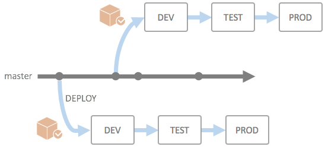
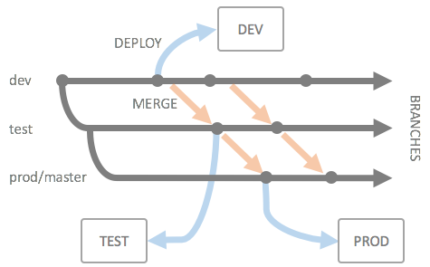
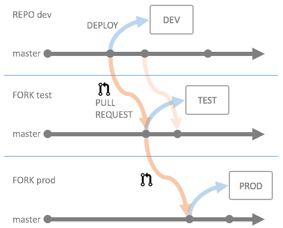

# Configuration Versioning Strategies

## Introduction

Depending on the structure of the underlying API services, you will need to follow different versioning strategies for the configuration repository. The API Portal always assumes that the configuration is stored within a source code repository, but still you have different ways of actually versioning the configuration and promoting changes between environments (dev, test, prod). The actual implementation of the API Portal takes place using a `git` repository, so there may be a certain bias towards git, but there are no actual obstacles which would prevent you from using SVN, TFS, Rational or CVS (don't).

The following strategies always assume you are having a three-tier system setup, but is nonetheless applicable to other kinds of systems with a different number of environments as well.

Additionally, these strategies are not mandatory in any way; if you need to implement a different strategy, feel free to do so. This is only meant as guidance.

### Continuous Integration and Deployment

In cases where you have set up deployment and testing to be fully automatic, chances are you have already adopted a CI/CD strategy, and you can do that for the API Portal as well:

At every push to the master branch a deployment takes place, first to the DEV environment, then subsequently to the other environments, using a packages artefact, and using always the same artefact (e.g. zipped configuration repository or similar). Between each deployment step environment specific tests are performed to make sure functionality is kept as it should be. This means all testing should be as automatic as possible to ensure this model works as intended.

Gates between environment deployments can be manual (click of a button) or automatic (as soon as tests pass, deployment can propagate to next environment).

Deployment pipelines like illustrated above can be implemented with most CI/CD systems. At Haufe we have set up this kind of systems using [ThoughtWorks' go.cd](https://www.go.cd).  

### Techniques Involving Merging

In case your backend services are not deployed continuously, but rather in explicit releases, versioning strategies involving explicit merging of changes may be of interest to you. The following sections describe two feasible versioning strategies.    

#### Versioning via Branches

From desktop development versioning strategies the following strategy may be known:

All development takes place in a "dev" branch, which is then subsequently merged (on the same repository) to downstream branches. This is not the "git" way of doing things, but may work better if you are using other source control systems. Especially TFS makes a good match for this kind of branching and merging, as cherry picking is a lot simpler than using git (which does not really allow for cherry picking).

As soon as the changes hit a target branch, a deployment should take place; either using automatic triggers, or manually. **Hint**: Automatic is good. 

#### Versioning via Forks

A way of achieving an effect like the above using the git toolbox would be to keep the configuration for different environments in different forks of a "dev" repository:

Changes are then propagated either using explicit cross-origin fetches and merges, or using pull requests. Pull Requests can be used to have a manual review process of the changes before propagating them to the next environment. **Hint**: Automatic testing is better than manual reviewing :-)

#### Caveats

When implementing a versioning strategy which involves manual merging and/or accepting pull requests, make sure that

* There are no differences in the intended end result of the configuration, i.e. you should still keep all the settings for all environments in all repositories/branches.
* You can move towards a CI/CD kind of deployment strategy for the long term

Alarm bells should shriek if you have actual differences in configuration for different environments which cannot be changed via environment variables or using the built-in [environment mechanisms](deployment-environments.md).